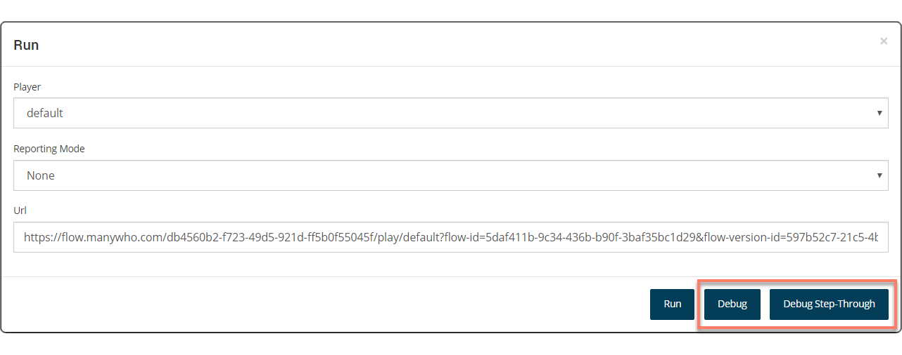

# Debugging a flow 

<head>
  <meta name="guidename" content="Flow"/>
  <meta name="context" content="GUID-a82ae672-dd07-469f-b2a4-baa8180cb522"/>
</head>

Debugging a flow enables you to observe the run-time execution of your flow in real-time and inspect a number of important execution elements including the call stack, state values, assertions, and any root faults created during execution.

## Overview 

When running a flow, you can optionally run the flow in either a **Debug** or **Debug Step-Through** mode.

-   **Debug**: Running a flow in this mode will launch the flow and populate the state values in the flow responses.​

-   **Debug Step-Through**: Running a flow in this mode will stop execution at every single element in the flow, including elements which work in the background \(such as a database load or an operator map element\). This allows you to monitor the flow, even when there are no elements to display to the user.​

- The debugger is composed of two panels:
   - The call stack is displayed on the left.
   - The state values, assertions, and root faults are displayed on the right.
- The debugger and each of its internal panels can all be resized by dragging the edges of the panels. 
The debugger can also be docked to the left and right of the canvas using the dropdown in the top right corner of the debugger.

## Call Stack

Call stack is a list of events triggered by progressing through a flow. Call stack events will show up in the left panel as soon as you just begin interacting with the running flow. A call stack event will be chosen by default as soon as it shows up in the panel. When selected, the corresponding tabs displaying the call stack events' related state values and root faults can be seen. Alternatively, you may choose the events yourself by clicking on call stack. The call stack panel's bottom left corner contains a checkbox that you may use to pin your selection.

Each call stack event has the following associated:

- A specific map element that has been executed during the event
- State values
- Root faults

## State Values

Provides one or more value elements that have been utilized at the point that a call stack event has been triggered. 

## Assertions

Assertions is a configured rule that is tested against the content value of each state value element. You will receive a notification if the assertion is satisfied.

### Creating Assertions

You can add an assertion from inside the assertions tab. There are three required fields:

- **Value** - Select a value that you expect to be used by your running flow.
- **Operator** - Select a logical operator used by the assertion during evaluation.
- **Expected content value** - Based on the logical operator you chose, the assertion will compare this to the actual content value of your selected value.

Once an assertion has been added, it will be evaluated against a call stack event's state values at the following points:

- When a call stack event is selected
- A new call stack event is generated
- When the assertion is altered

:::note

Creating assertions against values of type Object, List, Password and Encrypted are not supported

:::

## Root Faults

Provides the errors that have been generated by a specific call stack event. These errors are typically derived from failed connector calls.  A root fault's information will differ depending on the connectivity.
