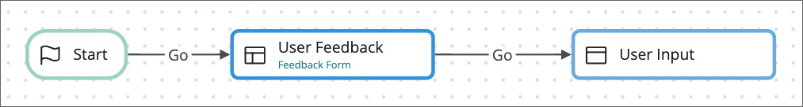

# Building a simple web application

<head>
  <meta name="guidename" content="Flow"/>
  <meta name="context" content="GUID-05440a6a-7695-4af8-8f12-e36c82d14f4b"/>
</head>


Getting started with using Flow to build your first flow web application.



## About this tutorial

In this tutorial, you will build a simple 2 page web application to collect user input on one page, and display these details on a subsequent page.

**What you will learn**: This tutorial is designed for flow beginners, and aims to introduce some of the main basic concepts involved in creating a simple flow web application, such as flows, pages, values, the flow canvas, map elements, outcomes, and running and publishing a flow.

 **Duration**: 20 mins | **Skill level**: Beginner 

## Step 1: Sign in to your tenant

Once you have created a Flow account, you can sign in and select a tenant in which to create the flow.

1. Sign in to your Flow account.
2. Select the tenant in which to create the flow from the [Account menu](c-flo-Tenant_menu_de6da113-3aab-4c23-aff0-5e42908b3536.md).
3. The **Flows** page opens. Any existing flows in the tenant are shown.

:::note

A [tenant](c-flo-Tenants_770f70ef-b441-4f1b-b565-2f87430e28f2.md) is where all your flows, values, connector integrations, and content is stored. You can have multiple tenants.

:::

## Step 2: Create a new flow

First, you need to [create a new flow](c-flo-Flows_Creating_a_new_flow_6745110f-738e-4a54-bf5e-c565e4c412a9.md).

1. Click **New Flow**.
2. On the **Create New Flow** form, name the new flow, for example "*User Feedback*".
3. Click **Save**.
4. The new flow is created, and the flow canvas opened in a new tab.

:::note

The [flow canvas](c-flo-Flow_Canvas_f063ba9b-b7f4-4484-8242-d51d4fb40fa6.md) is the visual drag-and-drop interface you use to build your flows.

:::

## Step 3: Create the user feedback page

On the flow canvas, add a [page map element](c-flo-ME_Page_539c415f-59d7-47d5-90ef-cb3a108b3010.md) to create the first page where a user can enter their feedback.

1. Drag a **Page** map element from the left-hand menu onto the canvas.
2. On the **New page** form, name the page, for example "*User Feedback*".
3. Click **New Layout** to create a new layout for the page.

## Step 4: Design the page

Use the [page builder](flo-pages-builder_eafc591c-11b8-4924-835f-beff9aecd8c5.md) to design and layout components to the page.

1. Drag an [input component](flo-pages-components-input_e6b419b2-403d-409a-bcf3-77ed9f522fdb.md) onto the page to add a single line text box for a user to input their name.

    - **Name**: Enter a name for the component, for example "**Name*" as this field will allow a user to enter their name.
    - **Label**: Enter a label for the component, for example "*Name*".

2. In this example, you will store the user input inside a value. [Values](c-flo-Values_f83f964c-1348-475d-80b1-480daef433f7.md) are used to store data in a flow.

    1. Click **Select or create a new value**.
    2. Click **Create a new value**.
    3. Name the value, for example "*Name*". Make sure the value type is set as a string.
    4. Click **Save**.

3. Click **Save** to save the page.

4. Next, drag another input component below the "*Name*" component, and repeat the process above to create an "*Email*" component (including creating a new value to store the user input). This is to add a single line text box for a user to input their email.

    - **Name**: Enter a name for the component, for example "*Email*" as this field will allow a user to enter their email.
    - **Label**: Enter a label for the component, for example "*Email*".
    - **Value Name**: Email
    - **Value Type**: String

5. Click **Save** to save the page.

6. Finally, drag a [textarea component](flo-pages-components-textarea_0f2d61f9-99e8-4db8-a420-cf37eadc1554.md) below the "*Email*" component, and repeat the process above to create a "Feedback" component \(including creating a new value to store the user input\). This is to add a multi-line text box for a user to input their feedback.

    - **Name**: Enter a name for the component, for example "*Feedback*" as this field will allow a user to enter their feedback.
    - **Label**: Enter a label for the component, for example "*Feedback*".
    - **Value Name**: Feedback
    - **Value Type**: String

7. Click **Save** to save the page.

8. Click on the **User Feedback** page tab to open the new page map element again.

9. Click **Save** to save the page.

## Step 5: Create the feedback details page

Now that you have created the first page to allow a user to input their feedback, you can create the next page to show their feedback.

This time, you will add a [step map element](c-flo-ME_Step_f2f3f25f-f6c8-4f34-9c44-6210cdef30a2.md) instead of a page map element. As a general rule in flow, if a page in your web application requires user input you should use a page map element, but if you just need to render a simple page (as in this case) you can use a step map element.

1. Drag a step map element onto the canvas.
2. On the **New Step** form, name for the step map element, for example "*User Input*".
3. In the **The content to be displayed to users** field, you can choose what content to show on the page. In this example, you will display the values entered by the user on the first page.

   For example:

   ```language-css
   Name: {![Name]}
   Email: {![Email]}
   Feedback: {![Feedback]}
   ```

   You can insert a value by clicking on the **Insert value** button in the content editor. This will insert the value reference, for example `{![Name]}`.

4. Click **Save**.

## Step 6: Join the pages using outcomes

The canvas now contains the 2 pages of your web application, which you will join together using outcomes.

1. Hover over the start map element until the cursor changes to a hand, then click, drag and drop onto the "*User Feedback*" page element.
2. Name the outcome, for example "*Go*".
3. Repeat this process, this time linking the "User Feedback" page to the "User Input" step element.
4. The flow should now show the map elements joined together on the flow canvas.

:::note

[Outcomes](c-flo-Outcomes_4049ee93-d7e4-4bc0-ba33-88e523bf4d89.md) allow a flow user to move from one map element to another, or from a map element into another flow. When the flow is run in a browser, outcomes are converted to clickable buttons. This is how a flow user can move between map elements \(pages\) in the flow.

:::

## Step 7: Run the flow

You can now run the flow in a browser to check that it works correctly.

1. Click the **Run** icon on the right-hand menu.
2. On the **Run** dialog, click **Run** to run the flow.
3. The flow is built, and runs as a web application in your browser.

:::note

[Running a flow](c-flo-Running_flows_5b0b848d-2528-4a14-b186-e393812b4664.md) allows you to generate and view a flow, but without making it the default version of a flow. This is different to publishing a flow, as the run URL changes each time you run a flow.

:::

## Step 8: Publish the flow

Once you have tested it, you can publish the flow to make it available to your users.

1. Click the **Publish** icon on the right-hand menu.
2. On the **Publish Flow** dialog, click **Run** to publish the flow.
3. The flow is built and published, and runs as a web application in your browser.

:::note

[Publishing a flow](c-flo-Publishing_Flows_ace67655-6267-49a1-a1dd-2eb29ac6c585.md) creates a snapshot of the flow and all the elements contained within it, and sets this as the default version of the flow. You can then always access the flow web application using the published flow URL.

:::

## Next steps

- [Flow Library](c-flo-Flow_Library_a477c269-4a2e-4a73-a0c8-c8145105e449.md): Browse and install example flows, page templates, and players, including the flow used in this worked example.

- [Understanding Values, Types, Objects, and Lists](c-flo-Values_Understanding_0a938b9f-c1be-45d9-b53f-aa9d0addad86.md): Learn how to work efficiently with data using values, types, objects, and lists.

- [Players](c-flow-Players_931f82a8-0725-4dc3-b965-f606330dc5a6.md): Create custom players to customize the user interface for your flows.

- [Connectors](c-flo-Service_Integrations_cac4d712-9607-4f24-8e70-aae48ceb27b9.md): Install connectors to connect your flows to external applications, such as third-party APIs and data sources.

- [Setting up and managing flows](c-flo-Setting-up-Overview_98cb7642-0e91-49b3-845a-c28f7451f134.md): Create, set up, and manage flows in your tenant.

- [Building and publishing flows](c-flo-Building_and_Publishing_Flows_3dba9a15-316f-4134-9093-d4811ea7d14f.md): Build, run, and publish, flows on the flow canvas.

:::tip

You can install this example "*User Feedback*" flow from the [Flow Library](c-flo-Flow_Library_a477c269-4a2e-4a73-a0c8-c8145105e449.md).

:::
