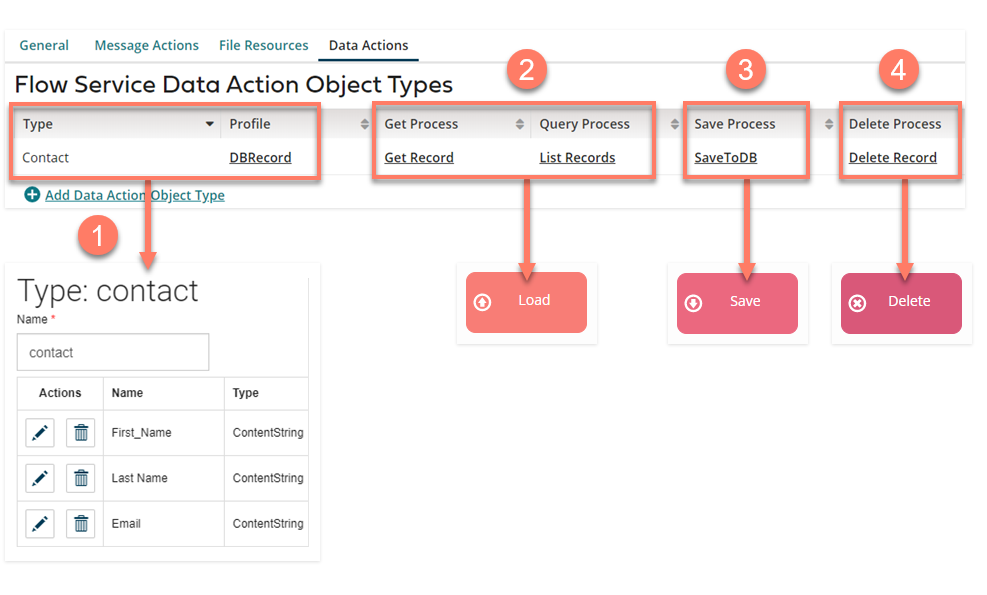
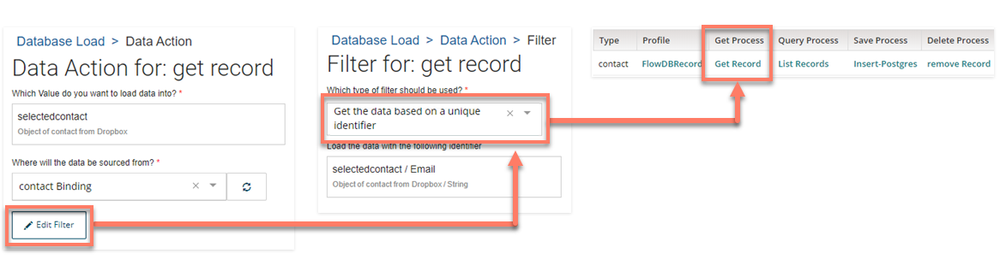
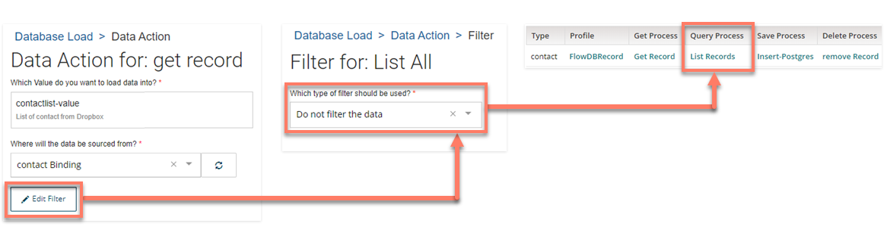
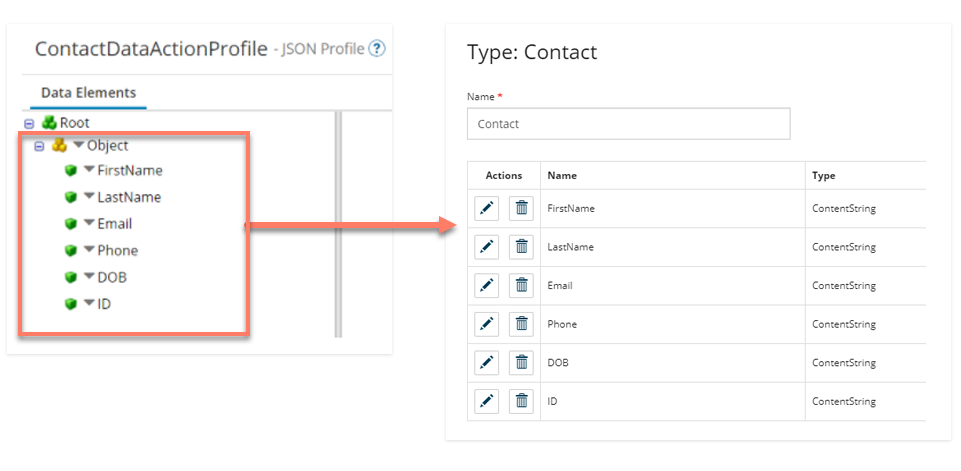

# Using Flow Service component Data Actions with Flow

<head>
  <meta name="guidename" content="Flow"/>
  <meta name="context" content="GUID-76d3fc99-d10d-46a1-b1b9-d19571bec6b6"/>
</head>

This type of Flow Service Operation is used to integrate with the database map elements in Flow that are used to handle all Create, Read, Update, Delete (CRUD) operations for a particular variety of record, using a single type in a flow.

[Database load map elements](c-flo-ME_Load_d47f5e01-a760-4aa2-8342-e843dd3abc48.md), [ Database save map elements](c-flo-ME_Save_bffa5a42-8d81-4dd9-9528-1eb26ae04d4c.md), and [ Database delete map elements](c-flo-ME_Delete_3488f656-867a-426f-911a-54b620716d0d.md) allow Flow to integrate with your Flow Service Data Actions and their associated processes.

Data actions are useful if you intend to send/retrieve the same kinds of records through multiple processes, as using a Message Action will automatically create a Request and Response type in the flow for any asscoiated processes. Using database map elements also allows you to display data from a service directly in a flow page, using certain page components, such as a Combobox, Radio, or Table component.

For a worked example of how you can use Data Actions with Flow, see [A worked example of using Data Actions with Flow](c-flo-AS_Integration_Flow_Tutorial_Sim_f8255f8b-0e12-4a79-bf6d-307c56639e1d.md).

Flow Service Data Actions are mapped to Flow as follows:

-   The JSON **Profile** you assign to the Data Action is used by the Flow Service to automatically create a corresponding type in Flow. 

-   Either the **Get Process** or the **Query Process** will be initiated by a Database Load map element in Flow, depending on the filter options specified in the map element Data Action (see below). 

-  The Save Process will be initiated by a Database Save map element in Flow. 

-  The Delete Process will be initiated by a Database Delete map element in Flow. 

## When is a Get Process or Query Process used? 

A Database Load map element Data Action can initiate either a **Get Process** or a **Query Process**, depending on the filter options specified.

-  If a filter based on a unique identifier is specified for the Data Action in the Database Load map element, the **Get Process** will be initiated. Only a single record is returned, and a unique identifier must be used.

    

-   If no filter or filter by ‘where’ is specified for the Data Action in the Database Load map element, the **Query Process** will be initiated. Multiple records can be returned with a Query, typically by populating a List value with the query results. These results can then be surfaced by loading this data directly from the service into a table component.
    
    

## Data Action profiles and Flow types

A Data Action profile always creates a single type in Flow; this type handles both Objects and Lists through the same single level JSON profile Object.

-   This is different to Flow Service Message Actions that do not always create a type in Flow, and also creates types that are specific to the Request or Response of a single particular process. See [Integration Profiles and Flow Types](c-flo-AS_Profiles_Types_676ebeec-a3e4-495e-8c14-4da287b2751a.md).

-  Profiles should typically be configured as a ‘flat’ JSON Object profile.