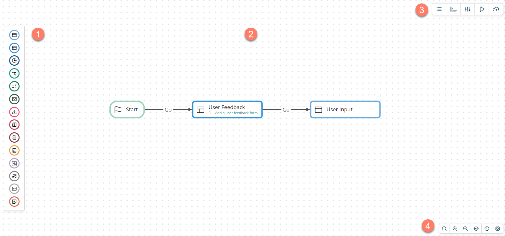

# The flow canvas 

<head>
  <meta name="guidename" content="Flow"/>
  <meta name="context" content="GUID-f063ba9b-b7f4-4484-8242-d51d4fb40fa6"/>
</head>

Use the flow canvas visual drag-and-drop interface to build your flows.

-   The left-hand elements menu contains all the map elements that you can add to the flow canvas.  See [Map elements](c-flo-Map_Elements_94361918-d868-4422-9bd4-94da7c46cd0f.md).

-   The main area of the flow canvas is where you build your flow.  See [Using the flow canvas](c-flo-Flow_Canvas_Using_9563eda3-a577-46d0-a444-7cada7c9413d.md).

-   The top-right-menu provides access to additional features used for building your flow. 

    -   **Shared Elements**: Import shared elements into the flow. These are elements that can be re-used across multiple flows within the tenant, such as common values, pages, types, connectors, and macros. See [Shared Elements](c-flo-Shared_Elements_85425302-deb7-4f96-aedd-be797a3224e5.md).

    -   **Navigation**: Add navigation to the flow to allow a user to navigate to different points within the flow at any time, rather than following the sequential path defined by the workflow. See [Navigation](c-flo-Navigation_871ceb19-15cf-4fe6-bc34-7e07acbf5878.md).

    -   **Properties**: Edit the main properties of the flow. See [Flow Properties](c-flo-Flow_Properties_b74d944d-9fec-43da-9ae3-fe0a5a370d00.md).

    -   **Run**: Build and run the flow. See [Running a flow](c-flo-Running_flows_5b0b848d-2528-4a14-b186-e393812b4664.md).

    -   **Publish**: Build and publish the flow. See [Publishing a flow](c-flo-Publishing_Flows_ace67655-6267-49a1-a1dd-2eb29ac6c585.md).

-   The bottom-right canvas toolbar allows you to access the canvas search feature, zoom in/out, fit the flow to the canvas view, and access the canvas help.  See [Canvas toolbar](flo-Canvas_Toolbar_4396313b-48e2-43e3-a697-a455dd1043e1.md).