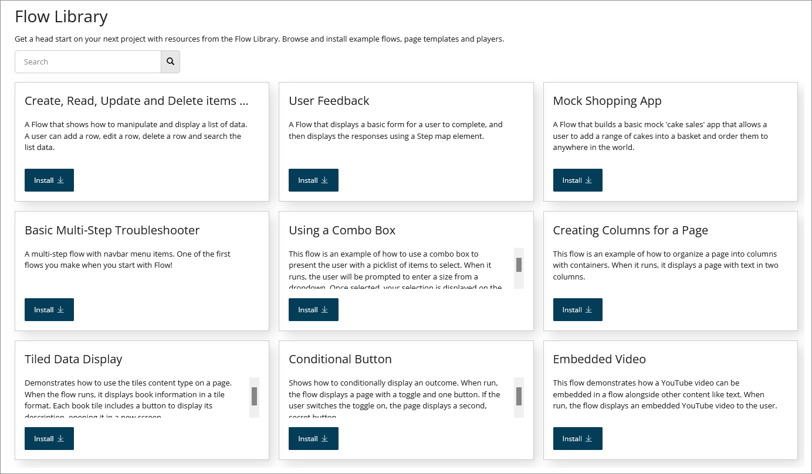

# Flow Library page

<head>
  <meta name="guidename" content="Flow"/>
  <meta name="context" content="GUID-7fa7146c-229c-4f92-812e-e731189c55b2"/>
</head>

The **Flow Library** page allows you to browse and install flows from the Flow Library.

## Opening the page

-   Click **Flow Library** on the **Getting Started** dialog that is displayed the first time you open the **Flows** page.

-   Select **Flow Library** from the left-hand menu.

## Page Overview

The **Flow Library** page displays all the flows available in the Flow Library:

Each flow in the library is displayed as an individual tile on the page.

-   The name, description and information about the flow is shown in the tile.

-   Click **Install** on a tile to install the flow into your tenant. See [Installing a flow from the Flow Library](c-flo-Flow_Library_Installing_174af4f8-cc53-4981-a7bc-fbf44f55f807.md).

## Searching the Flow Library

The **Search** field at the top of the page allows you to search for and filter which flows are displayed on the page.

1.  Enter the text into the **Search** field that you wish to filter the displayed flows by. Partial search terms can be used, for example, entering 'Date' will filter the list so that all flows containing 'Date' in their name will be shown.

2.  Click the **Search** icon to perform the search and filter the list.