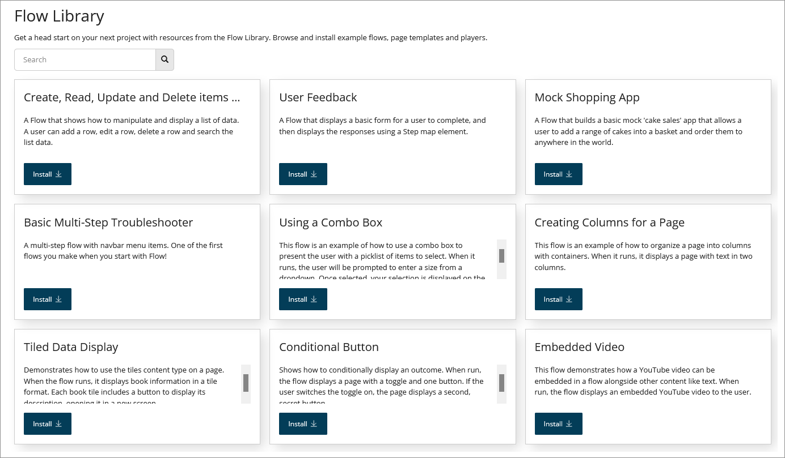

# Flow Library

<head>
  <meta name="guidename" content="Flow"/>
  <meta name="context" content="GUID-a477c269-4a2e-4a73-a0c8-c8145105e449"/>
</head>

The **Flow Library** provides a library of example flows, page templates, and players that can be installed into your tenant.

The resources contained in the Flow Library provide you with quick access to best practice templates for common flow functionality, helping you to get started with creating your own flows.

Browse and install flows, page templates, and players from the Flow Library on the **Flow Library** page.

-   The **Flow Library** page displays all the flows available in the Flow Library. See [Flow Library page](c-flo-Flow_Library_Page_7fa7146c-229c-4f92-812e-e731189c55b2.md).

-   To install a flow from the Flow Library, see [Installing a flow from the Flow Library](c-flo-Flow_Library_Installing_174af4f8-cc53-4981-a7bc-fbf44f55f807.md).

**Note:** The default setting for flows installed from the Flow Library is 30 days of inactivity before in-flight states are deleted. This can be modified on the **Flow Properties** form once the flow has been installed.