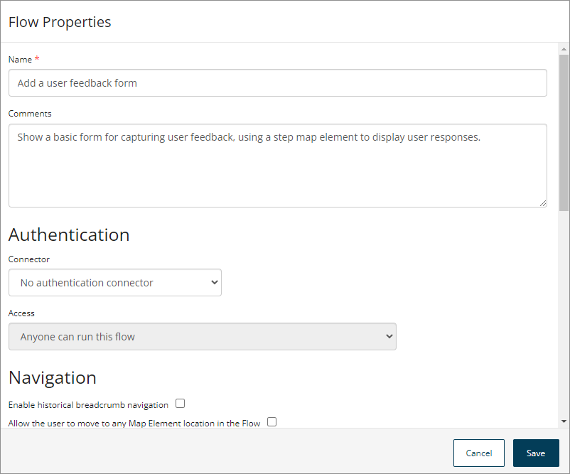

# Flow Properties

<head>
  <meta name="guidename" content="Flow"/>
  <meta name="context" content="GUID-b74d944d-9fec-43da-9ae3-fe0a5a370d00"/>
</head>

View and edit the properties for a flow directly from the flow canvas.

## Opening the Flow Properties form 

-   Select **Properties** from the right-hand menu on the flow canvas.

## Overview 

The **Flow Properties** form allows you to access and edit the properties for a flow.

The following basic flow properties are available for editing:

-   **Name:** Edit the name for the flow.

-   **Comments:** This optional field allows you to insert information about the flow that can then be viewed within by other users. These comments are not visible in the flow to runtime users.

:::note

Changes made on this form are not saved automatically. Click **Save** to save your changes to the flow and close the **Flow Properties** form.

:::

## Connector 
The **Connector** section allows you to specify connector authentication settings for the flow.

-   **Authentication provided by connector:** Edit the authentication connector used with the flow and the access type for the flow. Select the authentication connector you wish to use, or select the 'No Authentication Connector' option if you do not wish to use an authentication connector with the flow.

    If you select an authentication connector, you must then specify the type of access for the connector from the **Access** drop-down menu that appears:

    -   **Anyone can run this flow**: Select this option to build a public flow. Anyone with the flow URL can run a public flow. You can run the app yourself, or share the link with others.

    -   **Any user that can login with the selected identity connector can run this flow**: Users of the flow will need to authenticate themselves before they can run the app, using the authentication connector selected earlier.

    -   **Create restrictions for specific users and groups of users**: Restrict access to specific users or groups for the entire flow. For example, only a user that logs in with user@boomi.com will be able to access the flow. Anyone else, even if they can authenticate correctly with the selected connector, will be unable to access the flow. If you select this option you must add the users/groups that you wish to restrict access to in the **Groups** and/or **Users** section.

    :::note

       When defining access for a flow, you can also use a swimlane, by selecting the Swimlane element in the canvas to build a flow that passes control between users with different privileges. For example, there may be an ’employee’ swimlane and a ‘manager’ swimlane for a flow app that approves expenses submissions. See [Swimlane elements](c-flo-ME_Swimlane_872bacc3-8123-4bfa-9b87-8bc3ee9d8beb.md).

    ::: 

-   **Groups/Users:** If you have selected an authentication connector to use with the flow and the **Create restrictions for specific users and groups of users** option, you can add the users/groups that you wish to restrict access to in these sections.

    To add groups:

    1.  Click in the **Search to add groups** field in the **Groups** section and begin entering the name of any groups that you wish to add.
    2.  The search automatically returns any groups matching your search term. Select the checkbox for each group that you wish to add and click **Add Selected**.
    To add users:

    1.  Click in the **Search to add users** field in the **Users** section and begin entering the name of any users that you wish to add.
    2.  The search automatically returns any users matching your search term. Select the checkbox for each user that you wish to add and click **Add Selected**.
    Click the **Delete** icon in the **Actions** column to remove a group or user.

    :::note

       A maximum of 10 groups or users is returned by the search at any one time. If more than 10 groups or users are found that match the search term you have entered, you are notified that there are additional items, and that you should further refine your search.

    :::

## Navigation 

The **Navigation** section allows you to specify navigation settings for the flow.

-   **Enable historical breadcrumb navigation:** This checkbox allows you to enable historical navigation in the flow:

    -   Select the checkbox to enable historical navigation. If historical navigation is enabled, breadcrumb-style navigation links are inserted at the top of the flow, enabling users to quickly navigate back through their flow page history to previously visited pages. The **Navigation \| Allow the user to move to any Map Element location in the Flow** checkbox must also be selected to enable historical breadcrumb navigation. See [Historical navigation](c-flo-Nav_Historical_d63d245e-098d-4bd4-aa7e-fd3d937a33ba.md).

    -   De-select the checkbox \(default\) to disable historical navigation.

-   **Allow the user to move to any Map Element location in the Flow:** This checkbox allows you to specify user navigation behaviour for the flow:

    -   Select the checkbox to enable a user to navigate to any map element location when using the flow. For example, if you add a navigation menu to the flow that allows a user to freely jump around between pages. This checkbox must also be selected if you are enabling historical breadcrumb navigation.

    -   De-select the checkbox \(default\) to specify that the user can only navigate the flow via the set paths configured in the flow. For example, a user will only be able to access a page once it has been triggered within the flow - they are unable to simply jump to the page regardless of their location in the flow.

## Social Feed 

The **Social Feed** section allows you to specify social feed settings for the flow.

-   **Social feed for collaboration**:** Define whether a social feed is to be integrated with the flow:

    -   *None*: Select this option if a social feed is not required for the flow.

    -   *Display a social feed*: Select this option if you wish to display a social feed via the flow, for example, Chatter with Salesforce. Note that if using Chatter, your flow would need to use a Salesforce connector for authentication \(i.e. it cannot be a public flow\).

## State 

The **State** section allows you to specify state expiration and deletion times. See [Flow States](c-flo-Flows_Flow_States_32129a7c-a51a-4566-a406-3a66906818c6.md).

- **Number of days before the in-flight States should be deleted**: This setting allows you to specify in days how long the flow will hold it's 'status' before it expires.

    -  The default setting is that 'in-flight' states are normally never deleted. For example, if the flow is running and the current element still has outcomes then the data will be held indefinitely.

-  **Number of days of inactivity before the in-flight States should be deleted**: This setting allows you to specify in days how long the flow state can remain inactive before it expires. For example, you may wish a flow state to expire after *x* days of state inactivity.

    -  The default setting for newly created flows is 30 days.

    -  This setting must be defined as a value between 1 - 180 days, where 180 days is the maximum number of days that can be set.

    -  Once a state ‘expires’ due to this setting, any user who tries to join or progress through the flow will not be able to interact with the flow and will receive a message to inform them that the “*The state with ID 12345 has now expired*”.

## Snapshots 

The **Snapshots** section allows you to activate a previously built snapshot of the flow.

A snapshot is a version of a flow which is created every time you run or publish a flow. Activating a snapshot will only change the version of the flow that users see when they run the flow without a specific version id. The build version will not be affected.

- Click **Activate Flow Snapshot** in the **Actions** column to activate a snapshot.