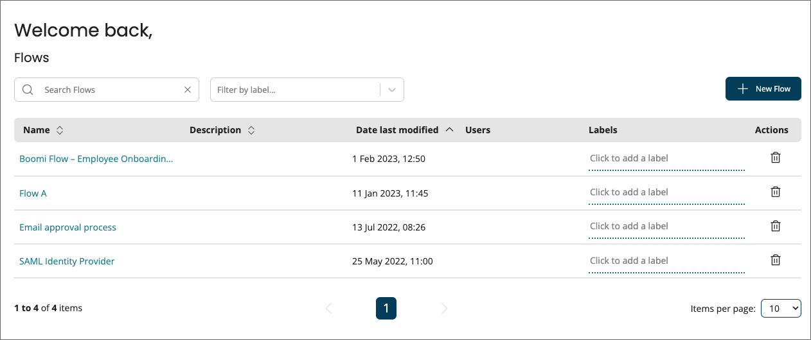

# Flows

<head>
  <meta name="guidename" content="Flow"/>
  <meta name="context" content="GUID-263d2c58-b3b9-463b-92c3-b828eb3362ea"/>
</head>

Create and manage your flows on the **Flows** page.

-   The **Flows** page displays all the flows currently set up within the tenant. See [Flows page](/docs/Atomsphere/Flow/topics/c-flo-Flows_Page_8ced41e7-5685-46ad-8c86-8b957e6683da.md).

-   Once you have created a flow, add and configure map elements on the flow canvas to define the workflow and functionality of the flow.

-   Run or publish a flow to generate it as a fully-functioning web application, accessed via a generated URL.

-   To get started with creating your first flow application, see [Creating a new flow](/docs/Atomsphere/Flow/topics/c-flo-Flows_Creating_a_new_flow_6745110f-738e-4a54-bf5e-c565e4c412a9.md).