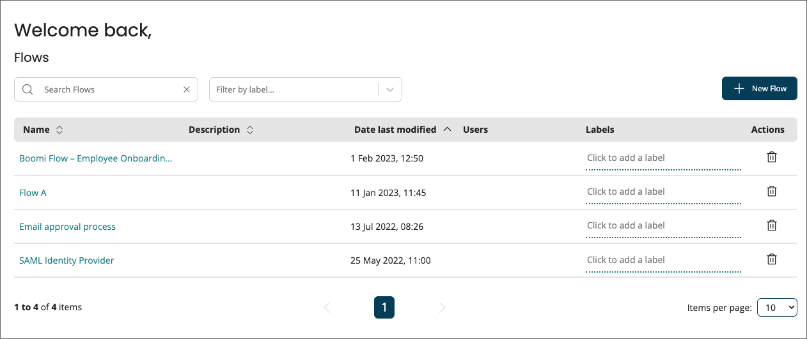

# Flows page

<head>
  <meta name="guidename" content="Flow"/>
  <meta name="context" content="GUID-8ced41e7-5685-46ad-8c86-8b957e6683da"/>
</head>

The **Flows** page is the first page shown once you have selected a tenant, and allows you to quickly view, edit, delete or run any existing flows within the tenant, as well as create new flows.

## Opening the page

-   After you select a tenant when first opening the software, the **Flows** page is displayed.

-   Select **Flows** from the left-hand menu.

## Page overview

The **Flows** page shows all the flows currently set up within the tenant:

Each flow is shown as an individual row on the page.

-   The name of the flow is shown at the top of each tile.

-   Any labels applied to the flow are shown. See [Flow labels](/docs/Atomsphere/Flow/topics/flo-Labels_feb71668-ade0-41ba-ba73-325641414373.md).

-   Click on a fllow name link to edit the flow. See [Editing a flow](/docs/Atomsphere/Flow/topics/c-flo-Flows_Editing_flows_90932dd7-f221-4320-9b1a-4edf793b5509.md).

-   Click the **Delete** icon to delete the flow. See [Deleting a flow](/docs/Atomsphere/Flow/topics/c-flo-Flows_Deleting_flows_a56e1462-73d1-4e05-9f7a-f9640e07b22a.md).

## Searching flows

The **Search** field allows you to search for and filter which flows are displayed on the page.

This is useful if you have a large number of flows in the tenant, or wish to quickly search for a specific flow.

1.  Enter the text into the **Search** field that you wish to filter the list by. Partial search terms can be used, for example, entering "Doc" will filter the list so that all flows containing "Doc" in their name will be shown.
2.  Click the **Search** icon to perform the search and filter the list.

## Sorting flows

You can sort flows on the page by either:

-   Last Modified \(Descending\)

-   Last Modified \(Ascending\)

-   Name \(Descending\)

-   Name \(Ascending\)

## Filtering by label

Add labels to flows to group and filter your flows on the **Flows** page. See [Flow labels](/docs/Atomsphere/Flow/topics/flo-Labels_feb71668-ade0-41ba-ba73-325641414373.md).
