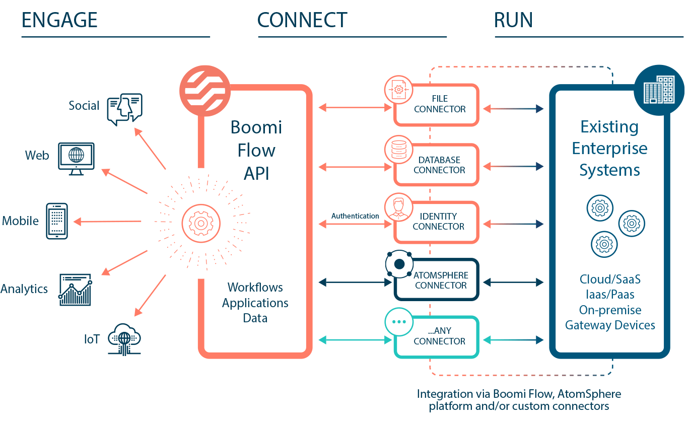

# Getting started

<head>
  <meta name="guidename" content="Flow"/>
  <meta name="context" content="GUID-f26280db-5b73-46dd-b087-4423f5dc6774"/>
</head>

Flow is a modern, cloud-native, low-code application development platform for creating customer journeys and automating simple and sophisticated workflows that accelerate your business outcomes.

Through the Boomi unified platform’s extensive connectivity, you can extend application and data integration capabilities to any business applications including online/offline mobile apps and web portals.

## Getting started with Flow

New to Flow? Get started with the following topics:

- [Using the Boomi Flow interface](c-flo-Using_the_Interface_961595e7-b17e-40bb-a815-63c0720ee04b.md) - Learn how to use the main application interface, how to navigate around, and the platform menu options available to you.
- [Building a simple web application](c-flo-Example_flow_05440a6a-7695-4af8-8f12-e36c82d14f4b.md) - Start building your first simple flow web application, and learn about the main concepts involved in building flows.

## Setting up and managing flows

Once you have successfully signed in to Flow, you can begin the process of setting up and managing your flows:

- [Setting up and managing flows](c-flo-Setting-up-Overview_98cb7642-0e91-49b3-845a-c28f7451f134.md) - Ready to begin setting up your own flows? Start creating, setting up, and managing flows in your tenant.
- [Creating a new flow](c-flo-Flows_Creating_a_new_flow_6745110f-738e-4a54-bf5e-c565e4c412a9.md) - You can create a new flow on the **Flows** page.
- [Understanding Values, Types, Objects, and Lists](c-flo-Values_Understanding_0a938b9f-c1be-45d9-b53f-aa9d0addad86.md) | Learn how to work efficiently with data, using values, types, objects, and lists.
- [Connectors](c-flo-Service_Integrations_cac4d712-9607-4f24-8e70-aae48ceb27b9.md) - Install connectors to connect your flows to external applications, such as third-party APIs and data sources.

## Building and publishing flows

Start building, running, and publishing your flows using the flow canvas.

- [Building and publishing flows](c-flo-Building_and_Publishing_Flows_3dba9a15-316f-4134-9093-d4811ea7d14f.md) - Learn how to build and publish your flows.
- [The Flow Canvas](c-flo-Flow_Canvas_f063ba9b-b7f4-4484-8242-d51d4fb40fa6.md) - Start using the flow canvas drag-and-drop interface to design your flows.
- [Map Elements](c-flo-Map_Elements_94361918-d868-4422-9bd4-94da7c46cd0f.md) - Learn how to add map elements to the flow canvas.
- [Running a flow](c-flo-Running_flows_5b0b848d-2528-4a14-b186-e393812b4664.md) - Generate and run your flow as a web application, without publishing it as the default version of the flow.
- [Publishing a flow](c-flo-Publishing_Flows_ace67655-6267-49a1-a1dd-2eb29ac6c585.md) - Publish your flow to set it as the default running version of the flow, making it available to your users.

## Flow and Integration

Flow applications can be seamlessly integrated with Integration, allowing access to the full range of connectors and applications supported by Integration and the Boomi Enterprise Platform.

- [Flow and Integration](c-flo-AS_Flow_Integration_29be6cb0-f11a-4eaa-a03a-d1ce7c42e77d.md) - Learn how to connect and use with Integration.

## API Reference

The [Boomi Flow API Reference](https://manywho.github.io/docs-api/) provides information on the available endpoints in the Flow RESTful API, including parameters and response data format. As Flow is based on an [API-first architecture](./c-flo-Techref_Architecture_b7cbf7a7-bcd0-4d1c-b926-69854df699ec.md),many of the operations performed within Flow can be accessed through this API.
