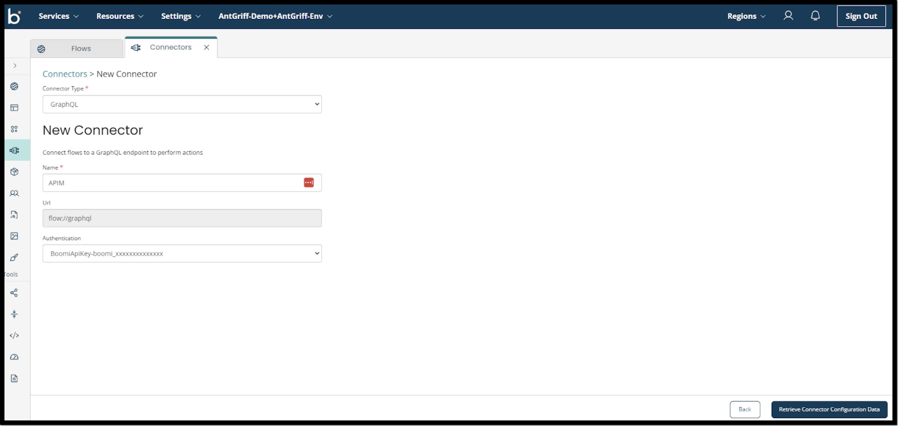
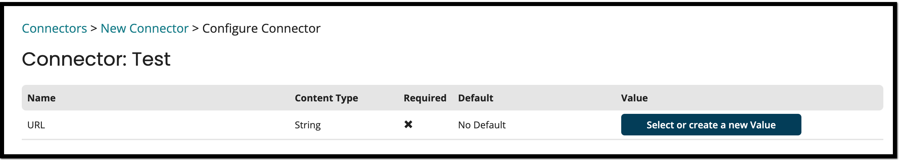

# Configure GraphQL Connector

<head>
  <meta name="guidename" content="Flow"/>
  <meta name="context" content="GUID-739146d5-5ddc-467d-b4da-b47631d3b846"/>
</head>

## Configuring GraphQL Connector

Follow the steps to configure the GraphQL connector:

1. Navigate to the **Connectors** screen.
2. Provide a name to your GraphQL connector under Name, the URL field is a pre-populated input.
3. Select the authentication provider under the **Authentication field**. Currently, only Boomi Integration Auth.
     
4. Select the Integration Account that we just created as a part of prerequisite.
5. Click **Retrieve Connector Configuration Data**.
6. Add a value for the URL as you are calling an API through this URL. For more information, see Select or create a new Value.
     
7. Click **Install**.
8. Click **Save Connector**.