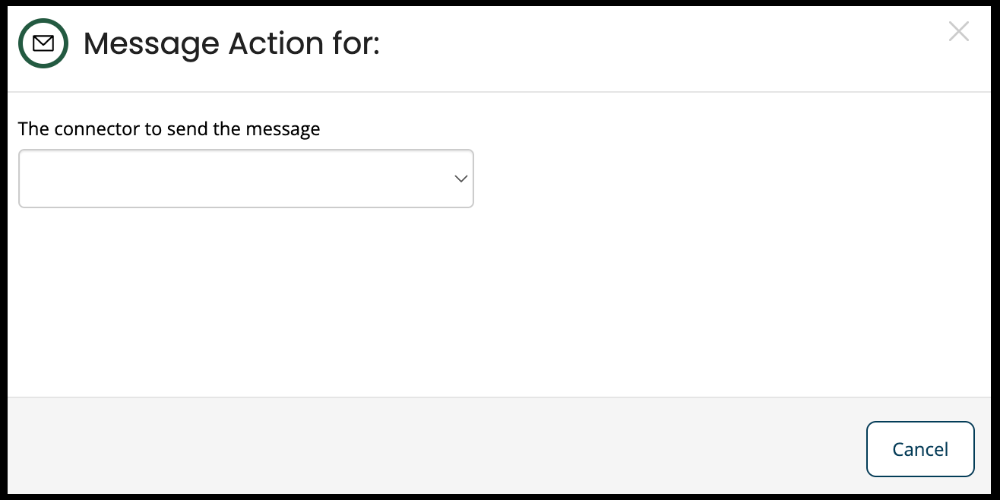
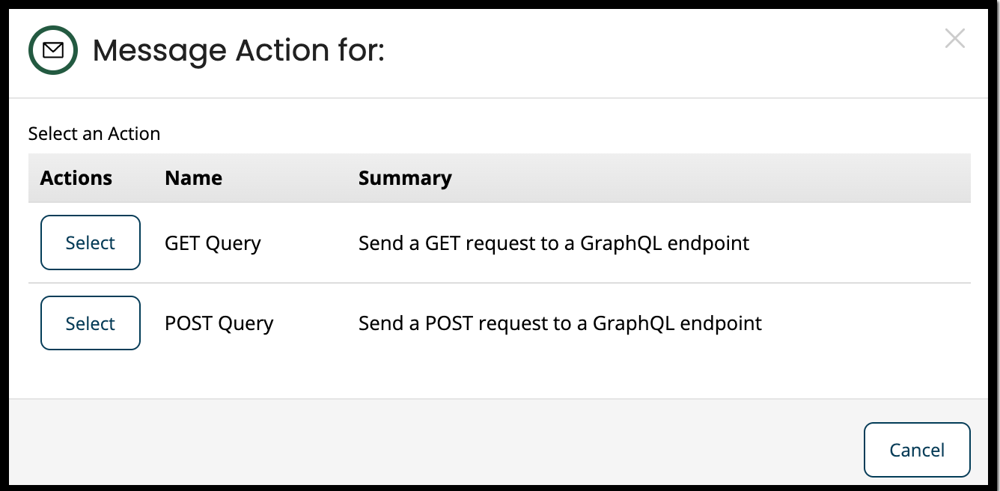

# Use GraphQL Connector

<head>
  <meta name="guidename" content="Flow"/>
  <meta name="context" content="GUID-2fac6f40-c93e-4bed-b579-519802742591"/>
</head>

## Using the GraphQL Connector in a Flow

To use the GraphQL connector in a flow, follow the below steps:

1. Drag a message map element onto the flow canvas.
2. The configuration panel for the message map element is displayed.
3. Enter a name for the map element in the **Name** field.
4. Click **Add Message Action** to add a message action.
5. Select the GraphQL connector that was just created by you, from the drop-down.

6. Select either of a query that you want request to a GraphQL endpoint:
    - **GET request**
    - **POST request**
    
7. After selecting the query action, select or create a new Value for the query:
   - Under Inputs, select or create a new Value for **Query** and **Variable**.
   - Under Output, select or create a new Value for **Response**, this can either be an object or a list.
     :::note

     You can add variables separately in the request, or build it up within the query value.

     :::
8. Save and link up the message element to the Flow.
