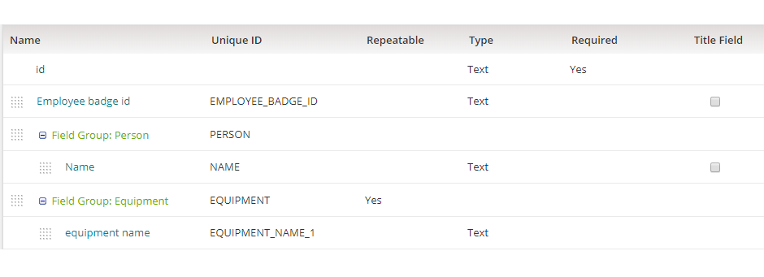
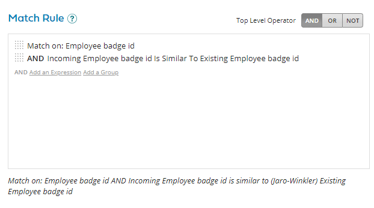
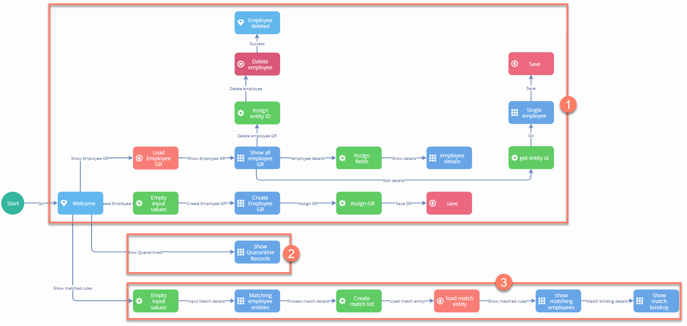
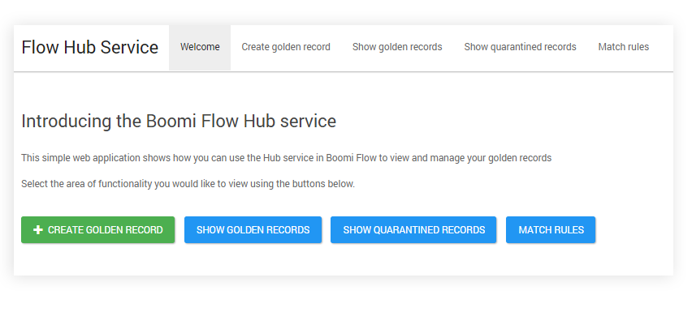

# Using the Boomi Master Data Hub connector

<head>
  <meta name="guidename" content="Flow"/>
  <meta name="context" content="GUID-57465a74-049e-483a-9278-e5a361f47a3c"/>
</head>

This topic provides a worked example of a flow using the Boomi Master Data Hub connector to retrieve and work with data from with Master Data Hub.

## About this worked example

This worked example is provided to help you get started with using the Boomi Master Data Hub connector by walking through a simple example flow.

## Setup

In this worked example, a simple Master Data Hub setup is configured and deployed.

Repository: Boomi Master Data Hub connector

A repository is created and assigned to the appropriate atom/cloud.

**Repository Name**: Boomi Master Data Hub connector

Model: Employee

A simple "employee" type of model is set up, containing a repeatable and a non-repeatable field group.

|Field/Field Group|Name|Type|Unique ID|Repeatable|Required|
|-----------------|:---|:---|:--------|:---------|:-------|
|Field|Employee badge id|Text|EMPLOYEE\_BADGE\_ID|-|Yes|
|Field Group|Person|-|PERSON|No|No|
|→ Field|Name|Text|NAME|-|No|
|Field Group|Equipment|-|EQUIPMENT|Yes|No|
|→ Field|equipment name|Text|EQUIPMENT\_NAME\_1|-|No|

Match Rules: Employee badge id

A simple match rule is added that checks for a match on:

Employee badge id AND Incoming Employee badge id is similar to \(Jaro-Winkler\) Existing Employee badge id

Source: Flow

A single source is attached to the repository:

**Name**: flow

**Entity ID URL**: https://flow.boomi.com/flow

## Installing the Boomi Master Data Hub connector in Flow

The is installed into a tenant, using the following configuration values:

|Name|Value Name|Value Kind|Access|Default Value|
|----|:---------|:---------|:-----|:------------|
|Hub Hostname|Hub: Hostname|String|Private - No external access|c01-usa-east.hub.boomi.com|
|Hub Token|Hub: Token|Password|Private - No external access|The value of the repository Token, taken from the **My Hub Authentication Token** field.|
|Hub Username|Hub: Username|String|Private - No external access|The value of the repository Username, taken from the **Username** field.|

Once the has been installed, a number of types are automatically generated to allow the flow to interact with the model:

-   The overall 'Employee' Model is translated into an '**employee**' type.

-   The 'Person' field group is translated into an '**employee - person**' type.

-   The 'Equipment' field group is translated into an '**employee - equipment**' type.

## An overview of the example flow

A simple flow is built to demonstrate how to interact with via the :

When the flow is run in a web browser, the user is presented with a welcome screen:

-   A simple top navigation element is added to allow a user to access each of the main flow areas.

-   The flow allows a user to view a list of golden records \('**Show golden records**'\), create a new golden record \('**Create golden record**'\), update a golden record, or delete a golden record.  See [golden records](/docs/Atomsphere/Flow/topics/c-flo-Hub_Example_GR_9a459fed-c850-4d9d-b727-04c5eb7d4090.md).

-   The flow allows a user to display a list of quarantined records \('**Show quarantined records**'\).  See [quarantined records](/docs/Atomsphere/Flow/topics/c-flo-Hub_Example_Q_1197f345-0862-49b6-b566-44227af6eda0.md).

-   The flow allows a user to input a value in order to test the match rules configured in \('**Match rules**'\).  See [match rules](/docs/Atomsphere/Flow/topics/c-flo-Hub_Example_MR_1d078b23-db22-492c-8a76-0a3660e37c51.md).