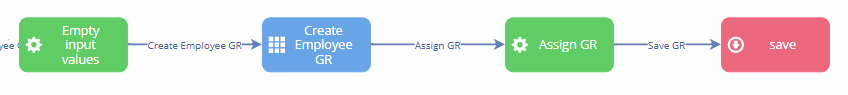
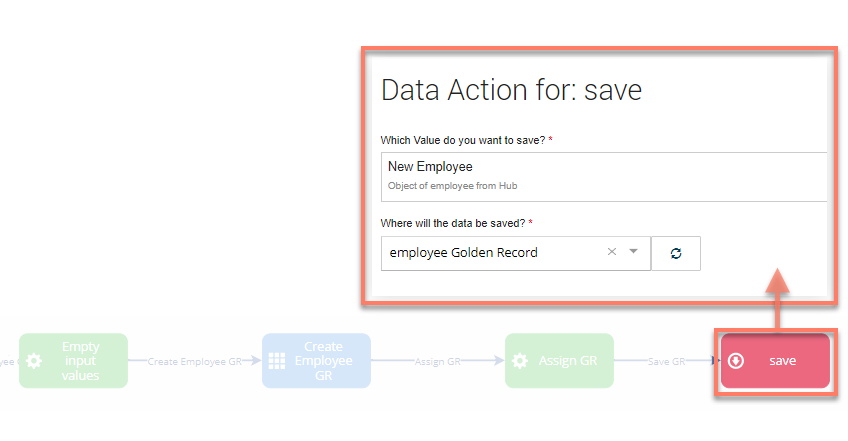
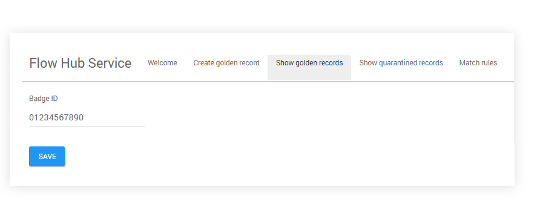

# Boomi Master Data Hub connector golden records

<head>
  <meta name="guidename" content="Flow"/>
  <meta name="context" content="GUID-9a459fed-c850-4d9d-b727-04c5eb7d4090"/>
</head>

This topic provides a worked example of using a flow to retrieve, display and work with golden records.

## Show golden records

The example flow is configured to display golden records as follows:

1.  A data action on the 'Load Employee GR' database load map element loads the golden records into a list object \('Employee list GR'\), using the employee golden record binding as the data source.

    

2.  The 'Show all employee GR' page map element and associated page layout then loads the golden records from this list object into a table. Two data columns are added to the table to show the employee badge id and the golden record id.

    

3.  There are three outcomes set to display on each golden record row in the table - the 'employee details' outcome allows the user to view the full details for the golden record, the 'edit details' outcome allows the user to edit/update the golden record, and the 'delete employee GR' outcome allows the user to delete the golden record.
4.  The 'employee details' outcome leads to an operator map element containing an operation to set the value of the selected employee to a selected person object, so that in the 'employee details' page map element the details for the specific employee can be retrieved and presented in a table.

    

5.  The 'employee details' page map element and associated page layout then loads the employee details for this list object into the page, using a table to display the repeatable 'equipment' field values.

    

When the flow is run in a web browser, navigating to the 'Show golden records' menu option will display the table of golden records from . The two outcomes are converted into clickable buttons to allow a user to create or delete the selected golden record.

Clicking on the 'View employee details' button will then display the details for the selected golden record.

## Create a golden record

The example flow is configured to create golden records as follows:

1.  The 'Empty Input Values' operator map element first empties any previous user input details, so that when a user creates a new golden record the input field values are empty to begin with.

    

2.  The 'Create Employee GR' page map element and associated page layout provides a form with input fields to allow a user to enter details for the new golden record. These values are stored appropriately in the flow, for example the equipment repeatable fields are stored in a string value.

    

3.  The 'Assign GR' operator map element then updates the necessary values with the user input via a series of operations.

    

4.  A data action on the 'save' database save map element saves the new employee into using the Golden Record binding.

    

When the flow is run in a web browser, navigating to the 'Create golden record' menu option will display the user input page that allows a user to create a new golden record. Clicking on the **Create golden** record button will initiate the operator and subsequent database save map elements, creating the new golden record in .

## Update a golden record

:::caution

To edit/update a golden record from within a flow, the entity id needs to be provided for the record.

:::

The example flow is configured to update golden records as follows:

1.  The 'get entity id' operator map element is used to specify the golden record entity id to be updated; to edit/update a golden record from within a flow, the entity id needs to be provided for the record. In the example flow, a series of operations are used to retrieve the entity id from the employee that is selected on the employee details page; in this example, the retrieved entity id is stored in the 'Golden Record: Links' list 'Entity ID' parameter \(rather than 'Golden Record: Entity ID'\).

    

2.  The 'Single employee' page map element and associated page layout provides a form with an input field to allow a user to view and edit/update the existing details for the selected golden record \(just the Badge ID in this example\).

    

3.  A data action on the 'save' database save map element updates the edited employee details into using the Golden Record binding.

    

When the flow is run in a web browser, navigating to the 'Show golden records' menu option and clicking on the **Edit details** button will display the 'Single employee' page.

This page retrieves the current golden record data for the selected employee, which can then be edited as required. Clicking **Save** will update the golden record in .

## Delete a golden record

The example flow is configured to delete golden records as follows:

1.  The 'Assign entity id' operator map element is used to specify the golden record entity id to be deleted.

    

2.  A data action on the 'Delete employee' database delete map element deletes the employee golden record from using the Golden Record binding.

    

3.  A step map element is added to inform the user that the employee golden record has been deleted.