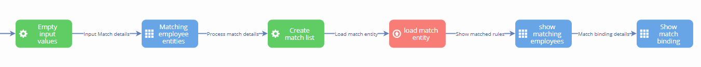
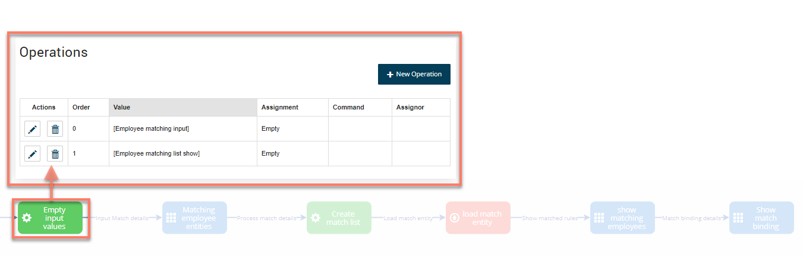
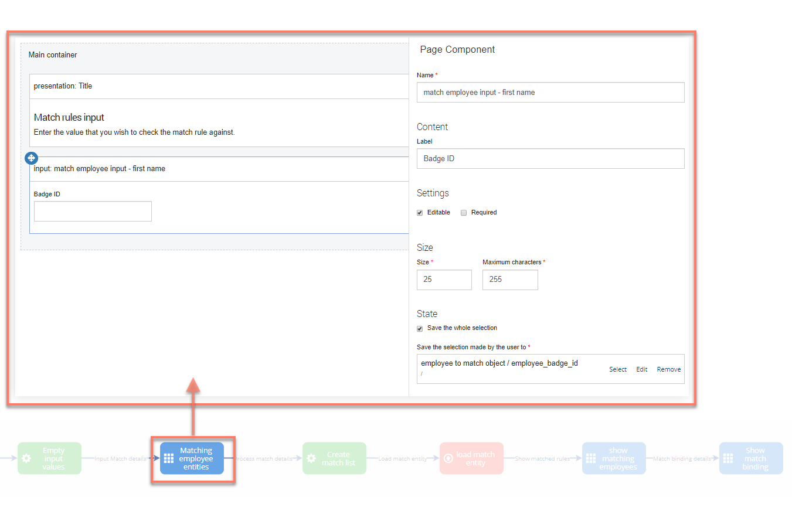
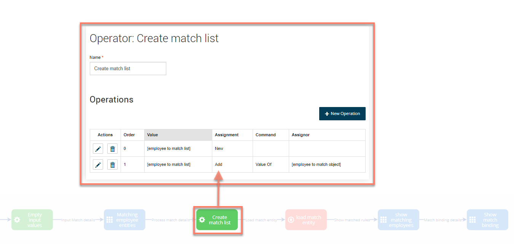
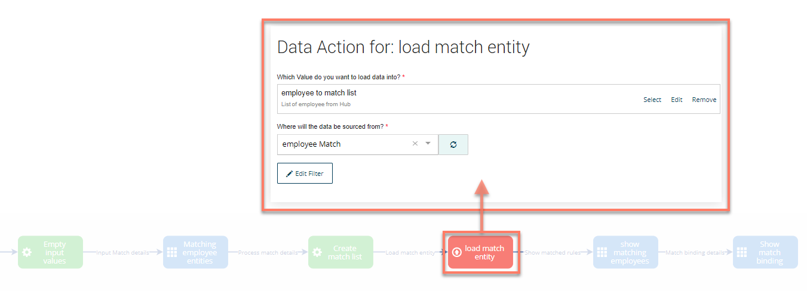
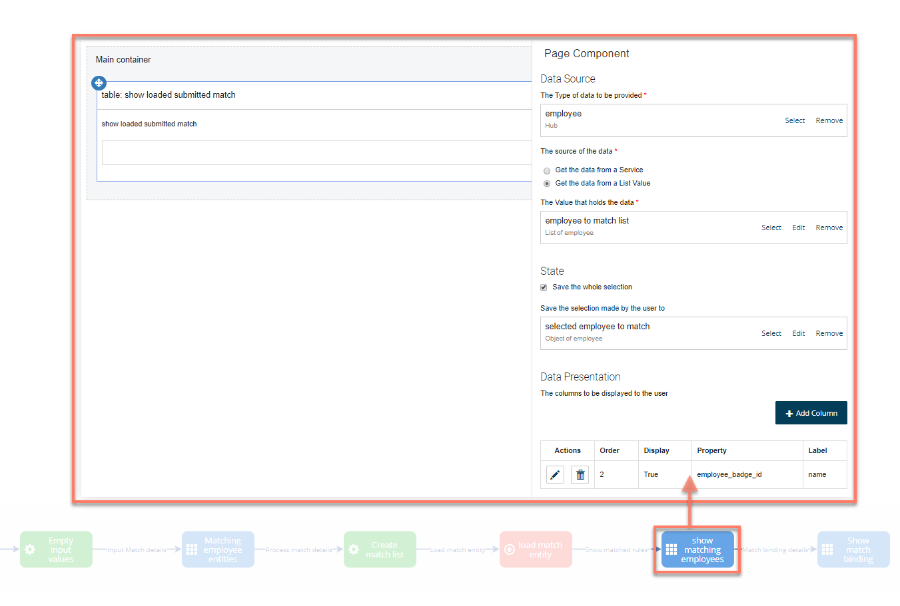
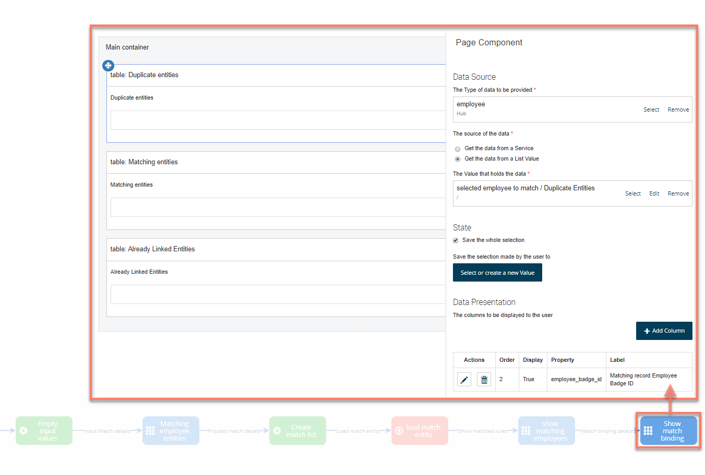
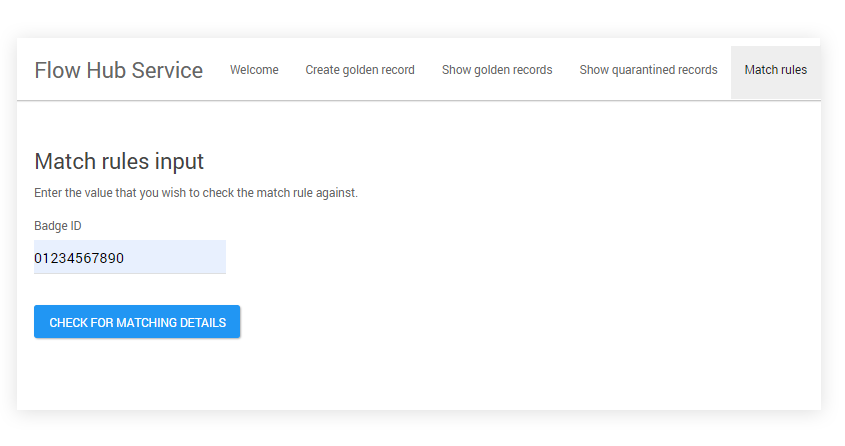
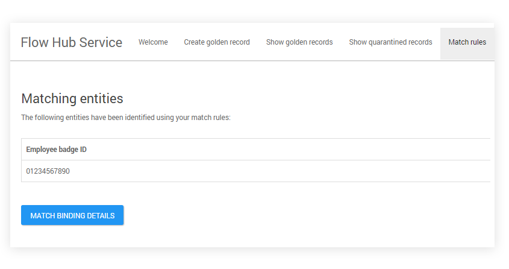
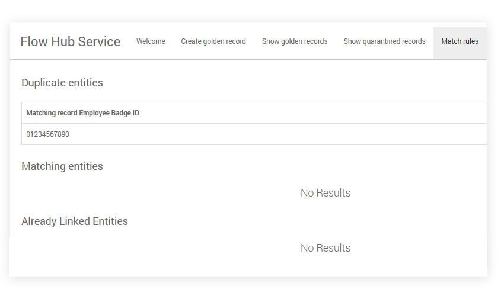

# Boomi Master Data Hub connector match rules

<head>
  <meta name="guidename" content="Flow"/>
  <meta name="context" content="GUID-1d078b23-db22-492c-8a76-0a3660e37c51"/>
</head>

This topic provides a worked example of using a flow to test the application of match rules against records.

## Match rules

The Match binding in the can be used to test if there is any existing record that matches a proposed new record. Using this matching binding won’t create a new record; it will simply return details of why the new record is not a valid golden record. There are three types of 'invalid' errors available in the binding:

-   **Duplicate entities**: If a proposed new record breaks any of the match rules set up in , it will be counted as a 'duplicate entity'. The match rule in this example model is doing exact matching on the badge ID.

-   **Matching entities**: A proposed new record will be categorised as a 'matching entity' if it matches the rule for an existing golden record but from a different source in .

-   **Already linked entities**: If matching a proposed new record with the entity id of an existing record, the input record would be returned as an 'Already Linked Entity'. This is different from the other two types of matching entities because existing records are returned rather than the input record provided by the user.

The steps for the example flow that allows a user to test match rules against records are as follows:

1.  The 'Empty Input Values' operator map element first empties any previous user input details, so that when a user searches for records using match rules, the input field values are empty to begin with.

    

2.  The 'Matching employee entities' page map element and associated page layout allows a user to enter the details of the entity value that they wish to test against. In this example, only one input field is added; this is used to check existing entities against the employee badge id entered by the user.

    

3.  The 'Create match list' operator map element updates an 'employee to match list' list value with the employee badge id value that the user wishes to check the match rules against.

    

4.  The 'load match entity' database load map element then loads the employee Match binding data into the list value.

    

5.  The 'show matching employees' page map element and associated page layout displays to the user the list of matching entities as identified using the match rules from . A user can then click on the relevant employee in the table and view the match rules details in the 'Show match binding' page.

    

6.  The 'Show match binding' page map element and associated page layout displays three tables; depending on the reason why the entity was matched, the relevant table is populated. For example, if the entity was found to be a potential duplicate entity, the details are shown in the 'Duplicate Entities' table.

    

When the flow is run in a web browser, navigating to the 'Match rules' menu option will display the user input page that allows a user to enter the value that they wish to check the match rules against. In this example, the user enters a Badge ID of '01234567890' to check against their match rules.

The next page shows any matching entities that were found. In this example, only a single employee entity was found with a matching Badge ID, but if we were searching on a user name against multiple sources there would probably be multiple entities returned on this page. Clicking on a row to select the entity and clicking on the **Match Binding Details** button navigates to the next page that shows details of why the entity was identified as matching the rules in .

On the details page, in this example the entity was shown to have a matching duplicate entity already existing in .

