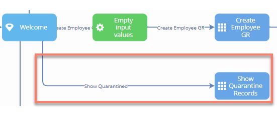
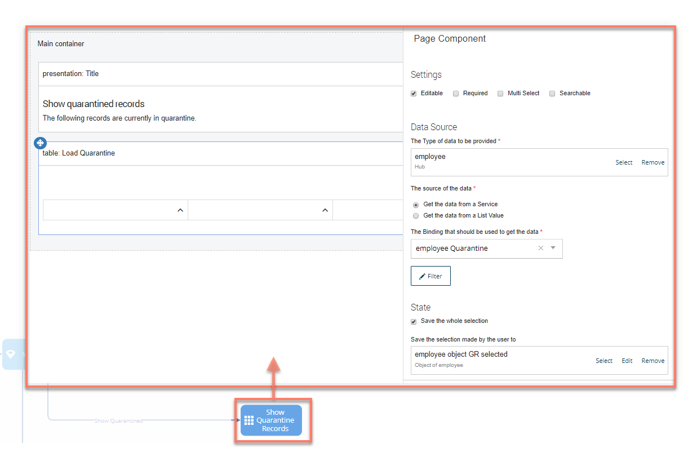
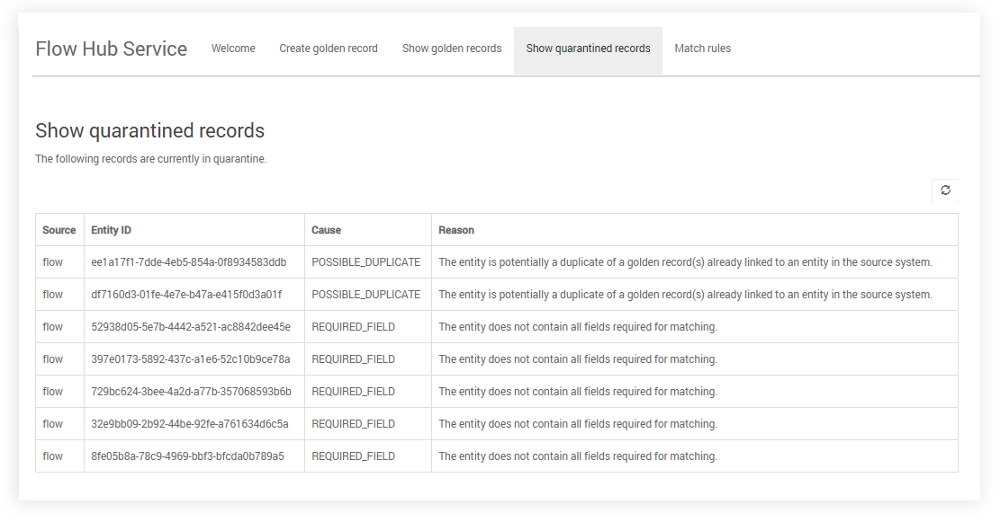

# Boomi Master Data Hub connector quarantined records

<head>
  <meta name="guidename" content="Flow"/>
  <meta name="context" content="GUID-1197f345-0862-49b6-b566-44227af6eda0"/>
</head>

This topic provides a worked example of using a flow to retrieve and display quarantined records.

## Show quarantined records

The steps for the example flow to display quarantined records are as follows:

1.  The 'Show Quarantine Records' page map element and associated page layout loads the quarantined records directly from the employee object into a table, using the Quarantine binding. Data columns are added to the table to show the Source, Source entity id, Quarantine Cause and Quarantine Reason.

    

When the flow is run in a web browser, navigating to the 'Show quarantine records' menu option will display the table of quarantined records from .

