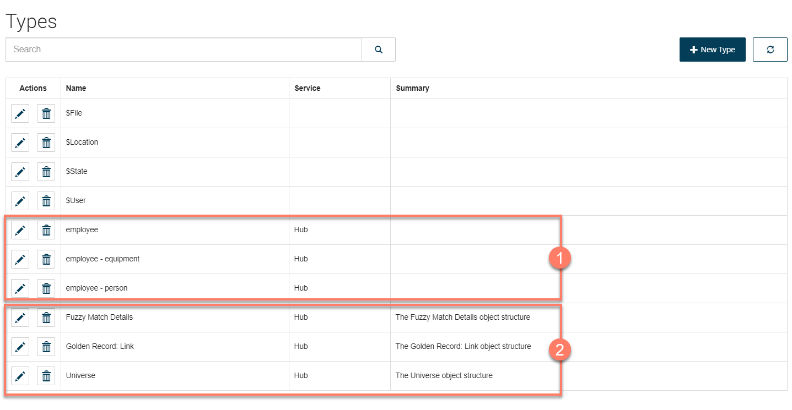
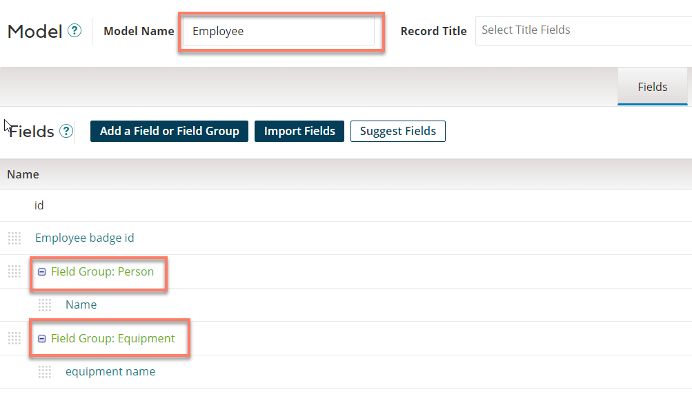

# Master Data Hub Connector Types

<head>
  <meta name="guidename" content="Flow"/>
  <meta name="context" content="GUID-65656c18-8d7f-4a03-819e-bce303fe7306"/>
</head>

When the Boomi Master Data Hub connector is installed, a number of types are automatically generated, along with types specific to your Boomi DataHub Model.

When the Boomi Master Data Hub connector is installed, the following types are created:

-   Each model in your repository and the field groups contained in the model are translated into a type 

-   A number of default types are automatically generated by the  connector 

## Model types

Each model in your repository is translated into a type. This model type has three bindings: "Match", "Golden Record", and "Quarantine", that allow you to work with and query the relevant information in a flow.

For example, in the following model, the model and the field groups contained within are translated into flow types as follows:

-   The overall "Employee" model is translated into an "**employee**" type.

-   The "Person" field group is translated into an "**employee - person**" type.

-   The "Equipment" field group is translated into an "**employee - equipment**" type.

## Default types

These default types are automatically generated by the :

-   **Fuzzy Match Details**: This type contains the information for duplicated or matching records when a Match Entity request is performed. This information is only returned when using specific algorithms to match rules in Boomi DataHub, for example using the similarity algorithm Jaro-Winkler in a match rules expression.

-   **Golden Record: Link**: This type contains the information of the list of entities associated with each golden record in Boomi DataHub.

-   **Universe**: This type contains the information for the specified universe.