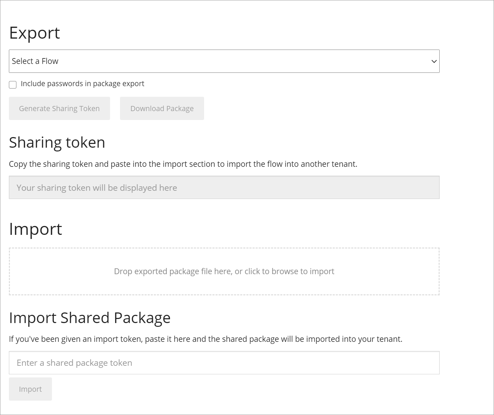

# Importing and exporting flows

<head>
  <meta name="guidename" content="Flow"/>
  <meta name="context" content="GUID-60fc4afb-d0dd-43fa-976e-d23a79dd0c24"/>
</head>

The **Import** and **Export** tools allow you to import flows from a different user or tenant into your current tenant, and export flows from your current tenant so that they can then be imported into a different tenant.

Flows are imported and exported via the [Import/Export page](c-flo-Import_Export_Page_3826cd50-3b59-45fd-819f-aa6d4256a79e.md).

-   Flow shared package files are exported using the JSON \(JavaScript Object Notation\) lightweight data-interchange format.

-   Flows can be imported and exported as either a shared package file or a shared package token.

-   To import a flow, see [Importing a flow](c-flo-Import_a_Flow_d6a6d656-0e4b-4e59-b830-cbec14557491.md).

-   To export a flow, see [Exporting a flow](c-flo-Export_a_Flow_68fc8c07-7e2a-4011-98f5-d3d40c295277.md).