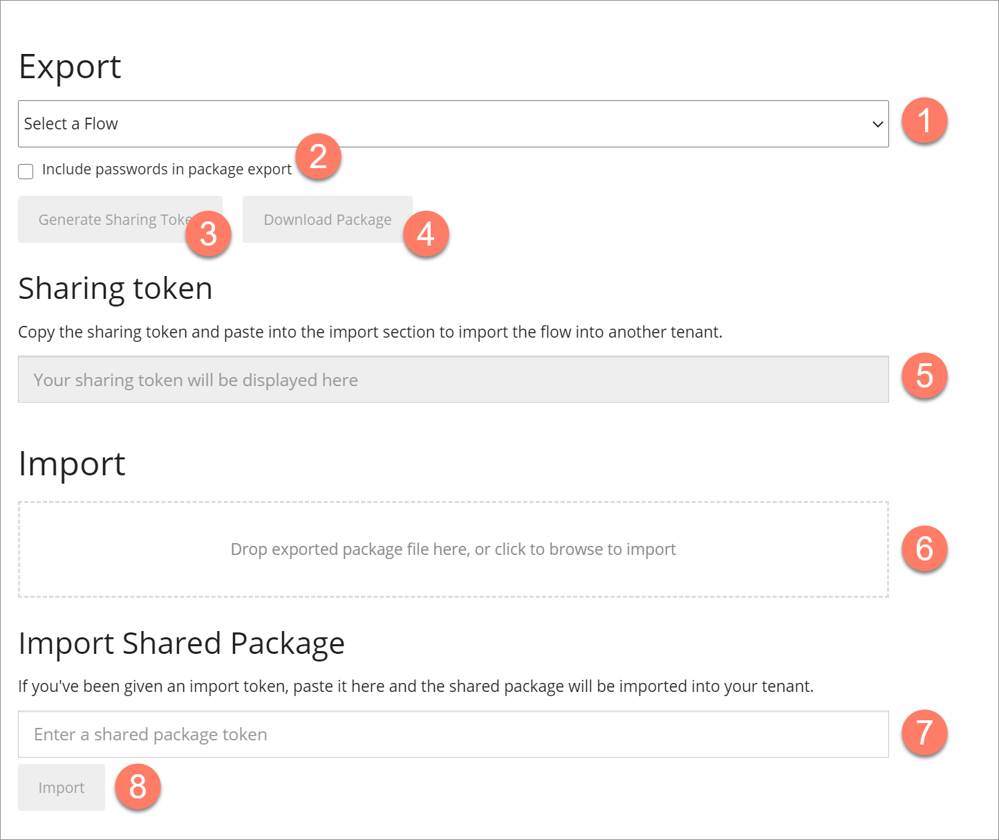

# Import/Export page

<head>
  <meta name="guidename" content="Flow"/>
  <meta name="context" content="GUID-3826cd50-3b59-45fd-819f-aa6d4256a79e"/>
</head>

The **Import/Export** page allows you to import and export flows from and into your current tenant.

## Opening the page

-   Select **Import/Export** from the left-hand menu.

## Page overview

The **Import/Export** page provides access to the **Import** and **Export** tools.

## The Export tool

The **Export** tool and options are located at the top of the page.

-   The **Export Flow** drop-down menu allows you select the flow you wish to export. 

-   The **Include passwords in package export** checkbox  allows you to define whether passwords are included in an exported flow. By default, passwords are not included in an exported flow, and this means that any connector passwords will need to be set again once a flow has been imported, as connectors may not work as expected until these passwords have been set. If you require passwords to be included when exporting a flow, select this checkbox.

-   The **Generate Sharing Token** button  allows you to generate a shared package token for the selected flow.

-   The **Download Package** button  allows you to generate a shared package file \(.package\) for the selected flow.

-   If you have generated a shared package token, the token is displayed in the **Sharing token** field.  Click the field to select the full token and copy it.

## The Import tool

The **Import** tool and options are located below the **Export** tool.

-   The **Import Package** field  allows you to import a shared package file, by either dragging and dropping the .package file onto the field, or by clicking the field and browsing to the package file.

-   The **Import Shared Package Token** field  allows you to enter/paste a shared package token.

-   The **Import** button allows you to begin importing your shared package file or token. 