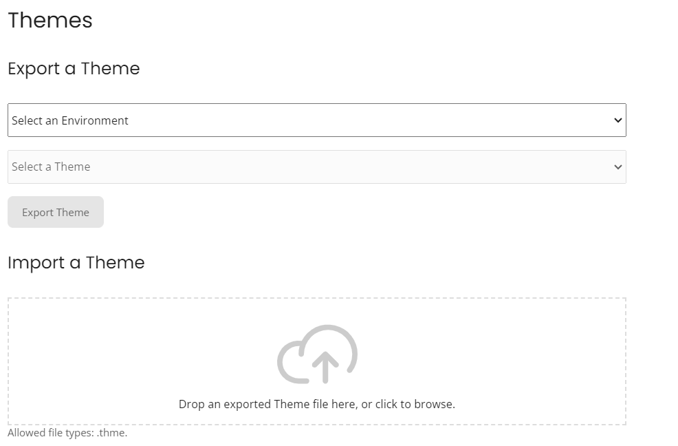

# Import/Export Themes

<head>
  <meta name="guidename" content="Flow"/>
  <meta name="context" content="GUID-b07505b5-aec4-4bc7-9c66-45b9add317e4"/>
</head>

The **Import** tool allows you to import previously exported theme into your current tenant. The **Export** tool allows you to export theme from your current tenant so that it can be imported into another tenant.

## Import a Theme

To import a theme:

1. On the Home tab, select Import/Export from the main menu.

2. On the Import/Export page, either:

   - Drag and drop the .thme file onto the Import Theme field.
   - Click the Import Theme field, browse to the file and click Open.

3. The Confirm Import dialog is displayed informing you of which tenant you are importing the theme into.

   - Click Confirm to import the file into the tenant.
   - Click Cancel to stop the import process and return to the Import/Export page.

## Export a Theme

To export a theme:

1. On the **Home** tab, select **Import/Export** from the main menu.

2. On the **Import/Export** page, select the environment from the **Select an Envirenment** drop-down menu from which you want to export the theme.

   :::note
  
   If the environment is ON, you need to select the environment before you select the theme to be exported.

   :::

3. Select the theme you wish to export from the Select a Theme drop-down menu.

4. Click on Export Theme where your file is downloaded in the *.thme* format.
