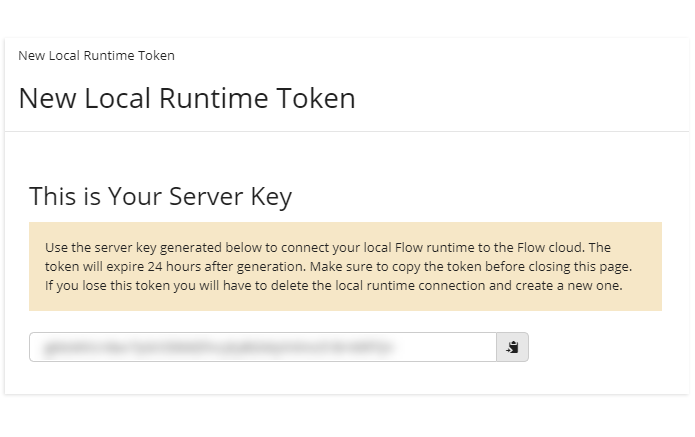

# Creating a local runtime connection in Boomi Flow 

<head>
  <meta name="guidename" content="Flow"/>
  <meta name="context" content="GUID-9569e2be-f4fe-4284-9559-58b5b9036b52"/>
</head>

To connect a local runtime to the Flow platform, you will need to set up a local runtime connection in your Flow Organization.

This is the local runtime entity in the Flow cloud that you can use to perform actions in a local runtime, such as deploying flows and viewing metrics.

Only Organization Administrators are able to access and set up local runtimes in a Flow Organization. See [Organization Settings page for Organization Administrators](flo-Organizations_Page_Administrators_8c6caca0-abab-41b2-8469-3f07ecd02ec6.md).

1.  Select **Organizations** from the top **Settings** navigation menu to open the **Organization Settings** page.
2.  Navigate to the **Local Runtimes** section.
3.  Click **New Local Runtime Connection** to begin setting up a new local runtime connection on the **Create Local Runtime** page.
4.  Name your connection and select the tenants that you would like to share the connection with.
    -   **Connection**: Enter a name for the connection.
    -   **Shared Tenants**: You may share this local runtime connection with your other Flow tenants, and allow those other tenants to deploy flows directly to this local runtime environment. Select any tenants that you would like to share this connection with.
5.  Click **Create New Local Runtime Connection**.
6.  The **New Local Runtime Token** The generated token that you will use to connect your local runtime to the Flow cloud is shown.

    

    -   Note that the token expires 24 hours after generation, and is single-use only.

    -   Copy the token before closing the page; if you lose this token you will have to delete the local runtime connection and create a new one.

7.  Click **Done** once you have copied the token and stored it safely as it is required when setting up your local runtime. See [Setting up a local runtime](c-flo-MC_Creating_Local_Runtime_22f793ae-5242-4530-be0b-107ecc12914c.md).