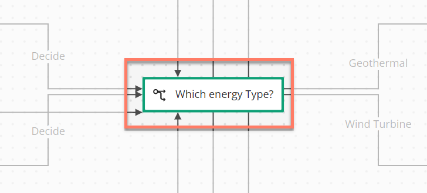
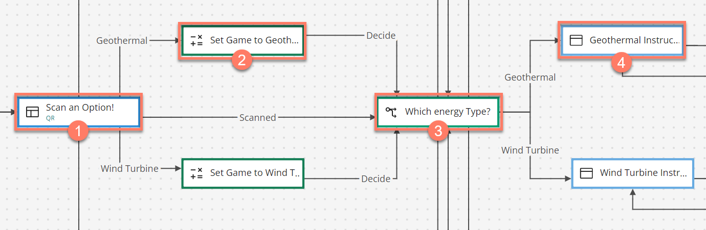
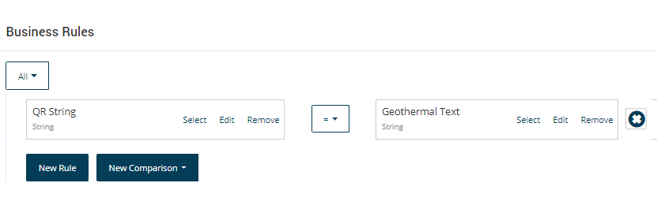

# Decision map elements 

<head>
  <meta name="guidename" content="Flow"/>
  <meta name="context" content="GUID-9ca6d47d-cb8f-40dd-8514-381dca308957"/>
</head>

Decision map elements allow conditional routing within a flow, for example where one incoming path gets split into two or more outgoing paths, based on pre-conditions. This is achieved using outcomes and business rules within a flow.

## Overview 

Decision map elements can have multiple outcomes connected both into and out of them, and effectively act as a conduit to define the path that a flow should take. This is achieved by adding business rules to the outcomes. See [Business rules](c-flo-Canvas_Business_Rules_e8860ab5-4260-449c-b72d-137d9902baec.md).

For example, a page map element could be set up so that when a user selects an item in a table, this value is passed into a decision map element, and a business rule \(or rules\) assigned to any outcomes that then define which outcome/path in the flow the user is directed along.

## Adding a decision map element 

To add and configure a decision map element:

1.  Add a decision map element onto the canvas.
2.  Link any outcomes **into** the decision map element, passing any values that may be needed for the routing logic.
3.  Link and edit any required outcomes **from** the map element to define the various paths that can be taken:

    -   Define the order in which the outcomes should be evaluated and processed using the **Order** field on the outcome. For example, setting an order to '1' will mean that outcome is checked before an outcome with an order set to '2'.

    -   Add business rules for each outcome to define the routing logic by clicking **Create Business Rules** when setting up the outcome. See [Business rules](c-flo-Canvas_Business_Rules_e8860ab5-4260-449c-b72d-137d9902baec.md).

## A worked example - using a decision map element to route a flow 

In this example, a flow is being used to present an interactive game to users.

1.  A page map element presents a user with the option to scan one of four different QR codes in order to select which type of game they wish to play. 
2.  Depending on which option is scanned, the user is then routed to the corresponding operator map element, which sets a simple string value "*\[QR String\]*" to the name of the selected game. In this example, the user has scanned the "*Geothermal*" option, so the value is set to "*Geothermal*". 
3.  This value is then used by a decision map element \("*Which energy Type?*"\)  to route the user to the relevant outcome and instructions page using business rules configured against each outcome.

    Each of the outcomes has a business rule applied that handles the routing logic. It will cycle through each outcome in the order specified, and check whether the business rule criteria has been met, before moving onto the next outcome. For example, the "*Geothermal*" outcome business rule checks whether the value was set to "*Geothermal*", and if not it will move to the next outcome.

    

4.  In this example, the user is routed to the 'Geothermal Instructions' page that provides information on how to play the game. 

## Adding an outcome 

Outcomes can be added to a decision map element.

-   [Adding Outcomes to a map element](c-flo-Config_Outcomes_d524e869-12d3-4f1f-b671-84872998773f.md)

## Adding comments to a map element 

Comments can be added to a decision map element.

-   [Adding Comments to a map element](c-flo-Config_Comments_647ce9d6-5c9e-4e27-aa29-1a69732957a5.md)