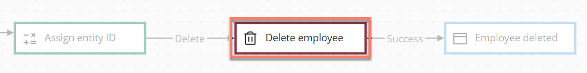

# Database delete map elements 

<head>
  <meta name="guidename" content="Flow"/>
  <meta name="context" content="GUID-3488f656-867a-426f-911a-54b620716d0d"/>
</head>

Database delete map elements allow data to be deleted in an external data source from a flow, such as data in a database.

## Overview 

Database delete map elements are used to delete data from a data source via a flow; typically this would be in an application database such as SQL, Salesforce, , and so on.

This is achieved by adding **data actions** to the map element to specify the source of the data and which data should be deleted via the flow. For example, if a flow has been set up for uploading and managing files, a database delete map element can be used to delete files as required.

Database operations can also be performed using message actions on a map element. See [Adding Message Actions to a map element](c-flo-Config_Message_Outcomes_81616add-ed70-45c7-a844-3e98f14844e2.md).

## Adding a data action to delete data via a flow 

To add a data action to a database delete map element:

1.  Add a database delete map element onto the flow canvas.
2.  **Name**: Enter a name for the map element.
3.  Click **New Data Action** to add a new data action. The **Data Action** panel is displayed.

    -   **Name**: Enter a name for the data action.

    -   **The order in which this Data Action should be loaded**: Specify an order in which the data actions should be performed. For example, a value of "0" will result in a data action being performed before a data action with a value of "1".

    -   **Disable this data action**: Temporarily disable the data action.

    -   **Which Value do you want to delete the data for?**: Define which value in flow contains the data you wish to delete. Click **Select or create a new value** to select an existing list or object value, or create a new value if required.

    -   **Where will the data be deleted from?**: Select the value type that will be used to retrieve the data. This is automatically populated with the available value types bound to the database you are using.

4.  Click **Add Data Action** to save the data action and return to the configuration panel. The new data action is shown in the **Data Actions** table. Add more data actions as required.
5.  Click **Save** to save your changes and apply the data action\(s\) to the selected map element.

## Adding an outcome 

Outcomes can be added to a database delete map element.

-   [Adding Outcomes to a map element](c-flo-Config_Outcomes_d524e869-12d3-4f1f-b671-84872998773f.md)

## Adding comments to a map element 

Comments can be added to a database delete map element.

-   [Adding Comments to a map element](c-flo-Config_Comments_647ce9d6-5c9e-4e27-aa29-1a69732957a5.md)