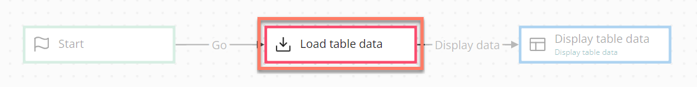
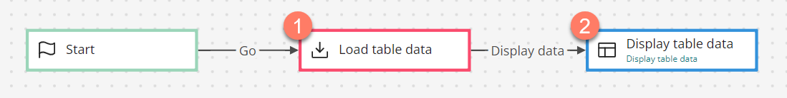
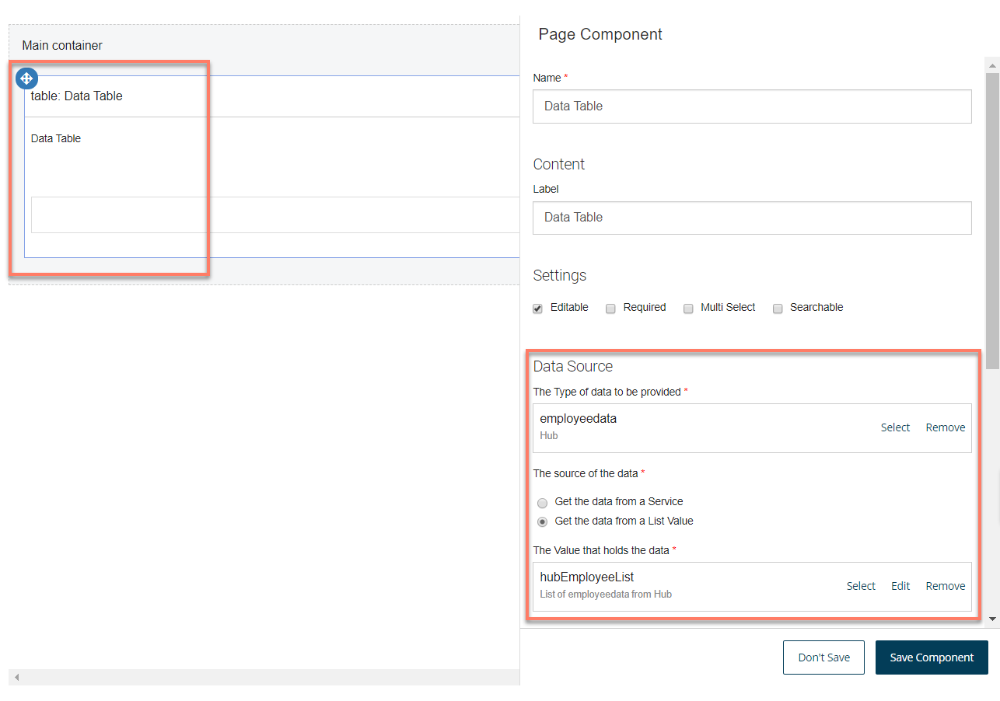
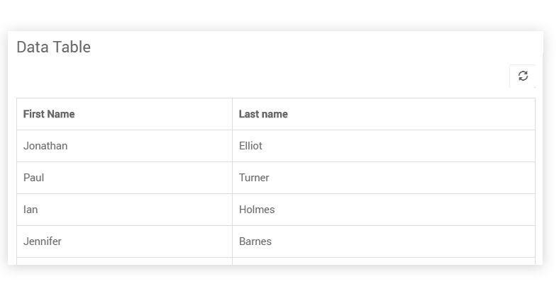

# Database load map elements 

<head>
  <meta name="guidename" content="Flow"/>
  <meta name="context" content="GUID-d47f5e01-a760-4aa2-8342-e843dd3abc48"/>
</head>

Database load map elements allow data to be loaded from an external data source into a flow, such as from a database.

## Overview 

Database load map elements are used to retrieve data from a data source and load this data into a flow; typically this would be from an application database such as SQL, Salesforce, and so on.

This is achieved by adding **data actions** to the map element, to specify the source of the data and where/how the data should be stored within the flow.

For example, if the SQL is installed in your tenant, a type is automatically created for each table in the specified database. A database load map element can then be used to load the data from one of these tables \(such as a 'users' table\) by loading the data from the relevant bound type into a list value. This could then be used in a page map element to display a list of users from the database.

You can also perform database operations by using message actions on a map element. See [Adding Message Actions to a map element](c-flo-Config_Message_Outcomes_81616add-ed70-45c7-a844-3e98f14844e2.md).

## Adding a data action to load data into a flow 

To add a data action to a database load map element:

1.  Add a database load map element to the flow canvas.
2.  **Name**: Enter a name for the map element.
3.  Click **New Data Action** to add a new data action. The **Data Action** panel is displayed.

    -   **Name**: Enter name for the data action.

    -   **The order in which this Data Action should be loaded**: Specify the order in which the data actions should be performed. For example, a value of "0" will result in a data action being performed before a data action with a value of "1".

    -   **Disable this data action**: Temporarily disable the data action.

    -   **Which Value do you want to load data into?**: Define where you wish to load the data into. Click **Select or create a new value** to select an existing list or object value, or create a new value to load the data into.

    -   **Where will the data be sourced from?**: Select the value type that will be used to retrieve the data. This is automatically populated with the available value types bound to the database you are using.

    -   **Edit Filter**: Allows you to optionally filter the data returned based on a unique identifier or using a 'where' statement filter. See [Data action filters](c-flo-Data-Action_Filters_7246bf53-46ad-4ecb-88f9-177803b59ac0.md).

4.  Click **Add Data Action** to save the data action and return to the configuration panel. The new data action is shown in the **Data Actions** table. Add more data actions as required.
5.  Click **Save** to save your changes and apply the data action\(s\) to the selected map element.

## A worked example - loading data and displaying it on a page 

In this example, data for a table of employees is loaded into a flow using the load map element.  The loaded data is then displayed as a table using a page map element. 

1.  Once the SQL has been installed into the tenant, a "*Load table Data*" database load map element is added and configured to retrieve the data from the "*employeedata Golden Record*" table. The retrieved data is loaded into a new "*hubEmployeeList*" list value that uses the "*employeedata*" type from the table.
2.  A page map element is added and linked to the database load map element. The page layout is configured to display a table of employees, using the value that the data was loaded into by the data action.

    

3.  When you run and view the flow in a browser, a table of employees is displayed on the page, using the data that was loaded into the flow.

    

## Adding an outcome 

Outcomes can be added to a database load map element.

-   [Adding Outcomes to a map element](c-flo-Config_Outcomes_d524e869-12d3-4f1f-b671-84872998773f.md)

## Adding a listener 
Outcomes can be added to a database load map element.

-   [Adding Listeners to a map element](c-flo-Config_Listeners_0ce8b82b-2175-4fb6-a047-427ac65d482b.md)

## Adding comments to a map element 

Comments can be added to a database load map element.

-   [Adding Comments to a map element](c-flo-Config_Comments_647ce9d6-5c9e-4e27-aa29-1a69732957a5.md)