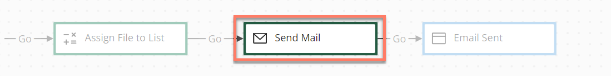

# Message map elements 

<head>
  <meta name="guidename" content="Flow"/>
  <meta name="context" content="GUID-342e9efb-0f11-4083-a2dc-195d52d1f939"/>
</head>

Message map elements allow the sending and receiving of requests to third-party messaging . These can be used to configure both incoming and outgoing messages.

## Overview 

A message map element can be added to a flow to send and receive message requests.

A message map element uses message actions to define the interface of inputs/outputs when calling against each message. Adding message actions allows you to map values in a flow to the inputs and outputs specified by a message map element.

See [Adding Message Actions to a map element](c-flo-Config_Message_Outcomes_81616add-ed70-45c7-a844-3e98f14844e2.md) to know the message actions are available is dependent on the that is being used when creating a message.

## Adding a message map element

To add and configure a message map element:

1.  Drag a message map element onto the flow canvas.
2.  The configuration panel for the message map element is displayed.
3.  Enter a name for the map element in the **Name** field.
4.  Click **New Message Action** to add a message action.
5.  Configure the new message action by selecting the messaging from the you have installed in the tenant and imported into the flow, adding actions as required to configure the message. See [Adding a message action to a map element](c-flo-Config_Message_Outcomes_81616add-ed70-45c7-a844-3e98f14844e2.md#section_unh_fkm_kkb).
6.  Add and link outcomes to the message map element as required to define the routing logic for the message map element.

## Worked examples using a message map element 

In the following worked examples, the Email is used to send an email message from a flow, using a message map element and message actions to configure the behavior of the and the actions taken when sending an email:

-   [Sending a simple email](flo-Email_Service_Using_b8686a9c-0899-4b72-9343-399511e3273b.md)

-   [Sending an email with a decision request](flo-Email_Service_email_decision_d52111d1-9a81-4f38-9625-6af47dc44096.md)

-   [Sending email attachments using the Email connector](flo-Email_Service_Attachments_cfd0438a-8a35-40d8-9c0b-c91a06c4c36b.md)

## Adding message actions

Message actions can be added to a message map element.

-   [Adding Message Actions to a map element](c-flo-Config_Message_Outcomes_81616add-ed70-45c7-a844-3e98f14844e2.md)

## Adding an outcome 

Outcomes can be added to a message map element.

-   [Adding Outcomes to a map element](c-flo-Config_Outcomes_d524e869-12d3-4f1f-b671-84872998773f.md)

## Adding listeners to a map element 

Listeners can be added to a message map element.

-   [Adding Listeners to a map element](c-flo-Config_Listeners_0ce8b82b-2175-4fb6-a047-427ac65d482b.md)

## Adding feedback to a map element 
Feedback can be added to a message map element.

-   [Adding Feedback to a map element](c-flo-Config_Feedback_1240ae6b-af20-4eee-b5b4-5e172926c4a4.md)

## Adding comments to a map element 

Comments can be added to a message map element.

-   [Adding Comments to a map element](c-flo-Config_Comments_647ce9d6-5c9e-4e27-aa29-1a69732957a5.md)