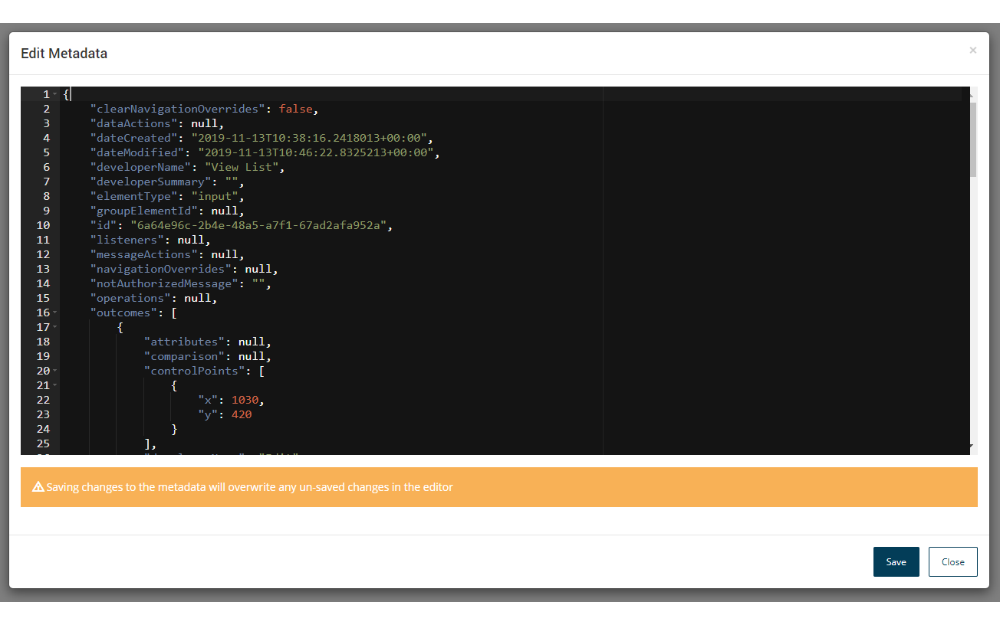

# Map element metadata

<head>
  <meta name="guidename" content="Flow"/>
  <meta name="context" content="GUID-b3d64956-567e-4dbc-92b9-3f174004d5ba"/>
</head>

converts map elements of a flow into JSON formatted metadata.

The metadata for a map element can be viewed and edited directly on the flow canvas.

1.  Press **Shift** and left-click on the map element you wish to view the metadata for.
2.  The **Edit Metadata** form is shown, allowing you to simply view the metadata, or edit it directly if required.

    

3.  Click **Save** to save any changes you have made to the metadata, or **Close** to return to the flow canvas.

:::note

Saving changes to the metadata will overwrite any unsaved changes in the editor.

:::