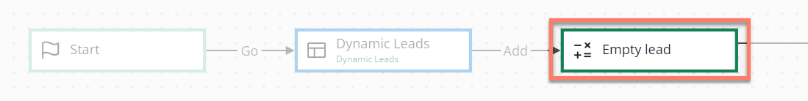

# Operator map elements 

<head>
  <meta name="guidename" content="Flow"/>
  <meta name="context" content="GUID-7d40c8c0-1da1-4acc-a659-18e534029ae6"/>
</head>

Operator map elements allow you to change the state of a value, using either standard operations \(such as adding values together, emptying a value, and so on\), or by using macros to perform more sophisticated operations \(such as percentage calculation, random number assignment, and so on\).

## Overview 

-   Once you have added an operator map element to the canvas, set up operations to it to modify values in the flow. Multiple operations can be added to an operator map element.

-   You can also add macros to perform more complex operations.

## Adding an operation 

To add an operation to an operator map element:

1.  Drag an operator map element onto the canvas.
2.  In the configuration panel, click **Add Operation** to open the **Operator** form.
3.  Click **Select or create a new value** to select the value you wish to work with.
4.  The **How do you want to change the Value?** menu is shown. Select the type of operation you wish to perform on the value from the supported operations.
5.  Depending on the content kind of the value you have selected, the **How do you want to retrieve the reference Value?** option may be displayed. Select the aspect of the value that you wish to use. For example, using the value content or the length of the value itself \(such as with a list\).
6.  Click **Add** to add the operation to the list of operations. A brief summary of what each operation does is shown in the **Operation** column.
7.  Click **Save** to save your changes.

If you have added multiple operations/macros, use the **Move up** and **Move down** arrow icons in the **Actions** column to define the order in which operations/macros are performed. Items at the top of the list are performed first, continuing down through the list in sequence.

Operations/macros can also be edited or deleted directly from the list using either the **Edit** or **Delete** icons in the **Actions** column.

## Supported Operations 

The following operations can be performed on values in an operation map element, dependent on the content kind of the value, such as whether it is a string, boolean, or number value, for example. See [Value content kinds](c-flo-Values_Content_Types_782220dc-722d-4d55-8576-e0274117e190.md).

| Operation | Value Kinds | Description |
| :-------- | :---------- | :---------- |
| Add | Number | - Add the numeric value from another value to the selected value.   - **Value of**: Add the actual numeric value to the selected value.   - **Length of**: Add an integer length to the value, this can depend on the other value type selected. For example, the length of a list value allows you to use the number of records in a list. |
| Concatenate | - Encrypted   - List   - String | - Join two values into a single value. For example, you could concatenate two text strings into a single text string such as 'first name' and 'last name' values. |
| Create New | - Boolean   - List   - Object | - Empty a value, and also create a new version of the value by changing the external ID of the value. Normally, if you save a value to a database and then make changes to the value and save it again, the database would check the external ID and overwrite the value again. But if you apply a `Create New` operation to the value, it will be emptied and when saving to the database it will be seen as a completely new value and add a new record to the database.   - For example, if you have set up a form to create a new Salesforce lead, when a user returns to the form to add in another lead, using a `Create New` operation before the user is returned to the form will start a new sales lead in the database, rather than overwriting the initial sales lead that was first created. |
| Divide | Number | - Divide the selected numeric value by another numeric value.   - **Value of**: Divide the selected numeric value by the actual value of the selected reference value.   - **Length of**: Divide the selected numeric value by the integer length of the selected reference value. |
| Empty | - Boolean   - Content   - Date/Time   - Encrypted   - List   - Number   - Object   - Password   - String | - Empty a value completely. For example, you might want to empty a value in a flow after a database save has been performed. |
| Modulo | Number | - Return the remainder (modulus) of the calculation performed by dividing the selected numeric value by another numeric value.   - **Value of**: Divide the selected numeric value by the actual value of the selected reference value.   - **Length of**: Divide the selected numeric value by the integer length of the selected reference value. |
| Multiply | Number | - Multiply the selected numeric value by another numeric value.   - **Value of**: Multiply the selected numeric value by the actual value of the selected reference value.   - **Length of**: Multiply the selected numeric value by the integer length of the selected reference value. |
| Remove | List | - Remove a value. For example, you might want to remove a specific record in a list. |
| Set Equal To | - Boolean   - Content   - Date/Time   - Encrypted   - List   - Number   - Object   - Password   - String | - Set a value to be equal to the content of another value. For example, you might want to set a value to be the same as another value retrieved using previous input from an end user (such as via an input field on a page map element). |
| Set Relative To | Date/Time | - Set a value that helps in performing the operations to retrieve the reference value based on the relative dates. You can add a value to a particular date, whereas the result is stored in another date. The value to reference will retain its original value after the completion of the operation.   - Once you select this option to retrieve the reference value, select the **Relative Operation** to `add`or `subtract` from the initial value. Following this, you need to select the unit measures such as `second(s)`, `minute(s)`, `hour(s)`, `day(s)`, `week(s)`, `month(s)` or `year(s)` and fill out the number of the unit measure. |
| Sort | List | - Define the sorting behaviour for list values within your flows. This allows table data to be pre-sorted for display, removing the need for a user to click a table column header.   - **Property to use for this sort:** Select the property to use for sorting the list.   - **Sort Direction**: Sort the list in ascending or descending order. |
| Subtract | Number | - Subtract the numeric value from another value to the selected value.   - **Value of**: Subtract the actual numeric value from the selected value.   - **Length of**: Subtract an integer length from the value, this can depend on the other value type selected. For example, the length of a list value allows you to use the number of records in a list. |
| Update | List | - Update a value. For example, you might want to update the value of a specific record in a list. |

## Adding a macro 
Macros can be added to an operator map element.

-   [Adding Macros to an operator map element](c-flo-Config_Macros_4655b4dd-4089-4539-865f-1d843788011a.md)

## Adding a navigation override 

Navigation overrides can be added to an operator map element.

-   [Configuring Navigation Override on a map element](c-flo-Config_Nav_Override_69de98e7-e100-4957-a865-2a2d76ffdb90.md)

## Adding comments to a map element 

Comments can be added to an operator map element.

-   [Adding Comments to a map element](c-flo-Config_Comments_647ce9d6-5c9e-4e27-aa29-1a69732957a5.md)