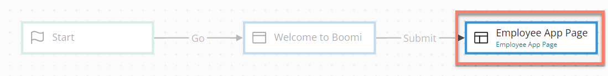
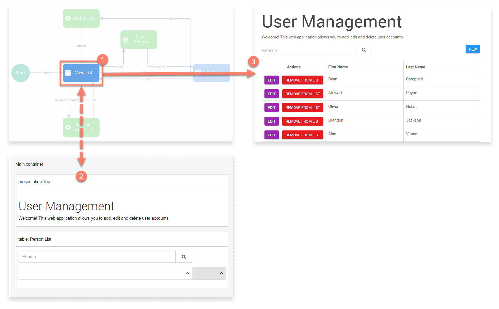

# Page map elements 

<head>
  <meta name="guidename" content="Flow"/>
  <meta name="context" content="GUID-539c415f-59d7-47d5-90ef-cb3a108b3010"/>
</head>

Page map elements are similar to step map elements in that they are used to present content to the users of a flow, however page map elements allow for more complex, interactive pages to be built.

Page layout templates are used to define the actual structure and functionality of the page. See [ Pages](c-flo-Pages_Overview_15c245e1-5232-4173-8a85-dae7ea7f060b.md).

## Overview 

Page map elements should be used when you wish to present a screen to an end user that requires information to be collected from the user \(such as via a form\) or if any complex user interaction is required.

Page map elements are added to the flow canvas to define where in a flow the page should be, with the actual structure and functionality of the page defined in a linked page layout template. Page map elements must be linked to a page layout. Once a page layout template has been created, it can be linked to and used by multiple page map elements. See [ Wait map elements](c-flo-Pages_Overview_15c245e1-5232-4173-8a85-dae7ea7f060b.md).

For example, the image below shows:

-   A page map element in a flow. 

-   The linked page layout that defines how the page is displayed to the end user. 

-   The screen that is displayed to the end user when the page map element is accessed in the flow using the default HTML5 player. 

## Adding an outcome 

Outcomes can be added to a page map element.

-   [Adding Outcomes to a map element](c-flo-Config_Outcomes_d524e869-12d3-4f1f-b671-84872998773f.md)

## Adding message actions 

Message actions can be added to a page map element.

-   [Adding Message Actions to a map element](c-flo-Config_Message_Outcomes_81616add-ed70-45c7-a844-3e98f14844e2.md)

## Adding listeners to a map element 

Listeners can be added to a page map element.

-   [Adding Listeners to a map element](c-flo-Config_Listeners_0ce8b82b-2175-4fb6-a047-427ac65d482b.md)

## Adding a navigation override 

Navigation overrides can be added to a page map element.

-   [Configuring Navigation Override on a map element](c-flo-Config_Nav_Override_69de98e7-e100-4957-a865-2a2d76ffdb90.md)

## Adding a wait 

Set a period of time for a page to ‘wait’ before the flow automatically continues along a specific outcome, if no action is taken on the page during this period such as selecting another outcome.

For example, you could set up an approval process so that a page proceeds automatically along an outcome if no approval action is taken in the configured wait time, such as escalating to an alternative approver.

To add a wait to a page:

1.  Select **Add Wait** in the **Waits** section.

2.  Define the wait settings:

    **Wait Type**: Select the wait behaviour. To learn more about the different **Wait Type** settings, see [Wait map elements](flo-ME-Wait_24d8b1a1-2f6e-4a55-821a-26c6928b2432.md).

    **Outcome**: Select the outcome to proceed along once the wait is complete.

3.  Select **Add**.

4.  The wait is added to the page.

    The wait starts when the page is shown in a flow, and will refresh and proceed along the selected outcome unless a different outcome is triggered first. The wait will start every time that the flow page is visited, in case the flow reuses the same page map element later in the flow.

## Adding feedback to a map element

Feedback can be added to a page map element.

-   [Adding Feedback to a map element](c-flo-Config_Feedback_1240ae6b-af20-4eee-b5b4-5e172926c4a4.md)

## Adding comments to a map element 

Comments can be added to a page map element.

-   [Adding Comments to a map element](c-flo-Config_Comments_647ce9d6-5c9e-4e27-aa29-1a69732957a5.md)