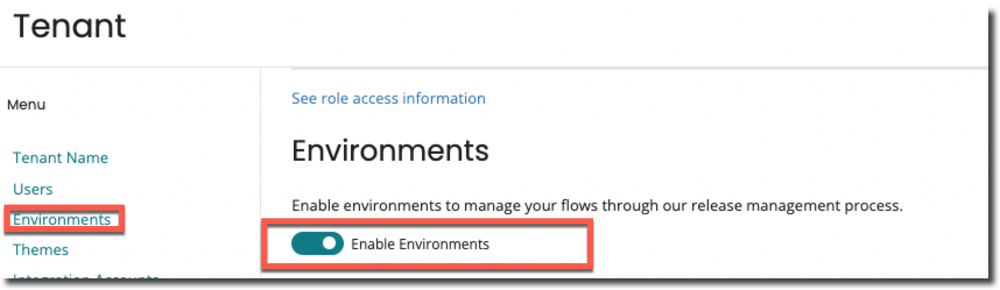

# Process Map Element

The process map element supports in setting up connections with your integration processes that allows you to add a process and construct an outcome by describing the process attributes. This allows you to harness the full potential of processes within Integration.

## Overview

Process map element allows you to connect with integration where you can add processes and create an outcome defining the process properties.

This enables you to tap into all your integration processes directly within the process map step.

:::note

The Open API connector may be more beneficial working with a large volume of data in Integration.

:::

## Setup

The steps to setup under tenant:

1. On the main menu, click **Settings** and select **Tenant** from the drop-down.
2. In the Tenant page, on the left side under Menu, select **Environments** and enable the Enable Environment toggle button.

3. On the same menu, select **Integration Accounts**, click **Add Integration Account**.
4. You will be directed to a page where you must enter your **Email Address**, **Account Id**, and **Atmosphere API Token**.

:::note

You can retrieve the Email Address, Account ID and Atmosphere API Token from your Integration Account.

:::

5. Select the **Integration Accounts** tab in the Environments page for each environment in your tenant and point the tenant environment to the relevant integration environment.

## Adding a Process

You can set up a process map element by adding a process and outcome, initially the following steps are to be performed to add a process to the process map element.

1. Add a new process map element to a flow and configure the process map element.
2. Click **Add Process**.

3. Select the process you want to execute from the dropdown.
4. Add any values that you want to send to the process as a **Dynamic Process Property**.
5. Add **Process Properties** that are identical to dynamic process properties (inputs into the process) but are specified in the integration.

  :::note

  For both Dynamic Process Property and Process Properties:

   - Simple value types such as string, number, and other values will be processed unchanged.
   - Currently, lists and objects will be serialized to a JSON string. Integration does not handle complicated lists or objects as Dynamic Process Property and Process Properties.
  
  :::

6. Select a Value to capture any return documents.
   - A single return document which might be a list, is currently captured.
   - The Auto Mapping feature will help by mapping to an existing type if the return document is a list or an object.
     - **Automapping**: While performing an operation and selecting a Value that is of a different Type than the target Value, a confidence score in the form of a percentage will be shown next to each potential value in the Value Selector. This score gives you an insight of the likelihood that a certain number of properties will be mapped from one value to the other.
     
   - For example, if Value 1 contains 10 attributes and 5 of them will be  mapped to Value 2, the confidence score is 50%.

:::note

The following are disregarded when comparing the property names that need to match:

- Casing
- Whitespace
- Underscores
- Hyphens

For example, the following property names are all the same to the auto mapper:

- FirstName
- first name
- First_name
- FIRST-NAME

:::