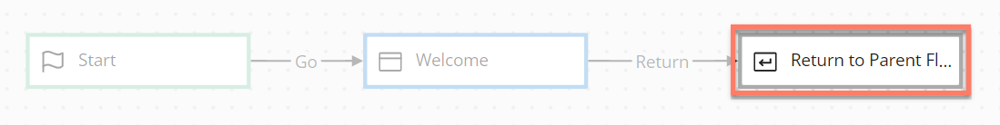

# Return map elements 

<head>
  <meta name="guidename" content="Flow"/>
  <meta name="context" content="GUID-d54ca14f-ff8b-43a6-af0b-db0174ad22df"/>
</head>

Return map elements are used in a subflow to indicate that the parent flow process should be rejoined from the subflow.

## Overview 

-   Adding a return map element to a flow will define when a child subflow should rejoin the parent flow.

    For example, if a subflow map element is used in a parent flow to initiate running a subflow, the user can only rejoin the parent flow if a return map element is added to pass the user back into the parent flow again. The user rejoins the parent flow at the point in the flow that the subflow map element is located.

-   Subflows without a return map element will not rejoin the master flow.

-   To learn more about using subflows, see [Subflows](c-flo-Subflows_ca879fac-5941-44d3-87df-69b97ac5c034.md).