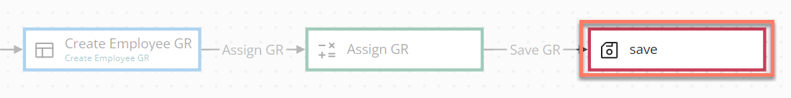
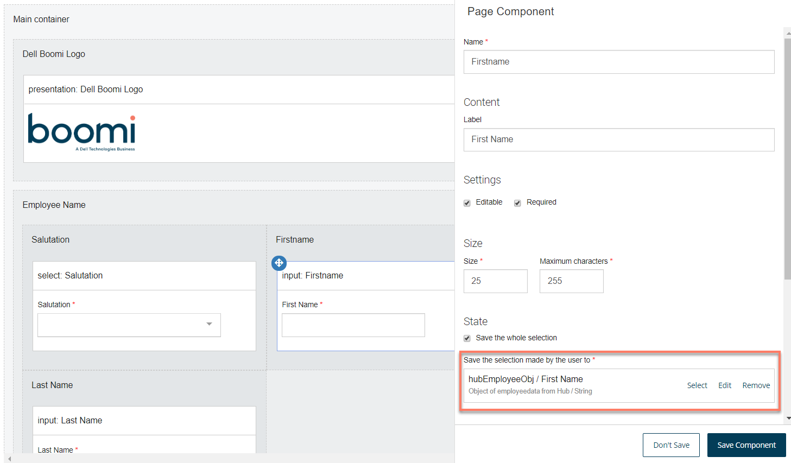

# Database save map elements 

<head>
  <meta name="guidename" content="Flow"/>
  <meta name="context" content="GUID-bffa5a42-8d81-4dd9-9528-1eb26ae04d4c"/>
</head>

Database save map elements allow data to be saved to an external data source from a flow, such as to a database.

## Overview 

Database save map elements are used to save data from a flow into an external data source; typically this would be into an application database such as SQL, Salesforce, , and so on.

This is achieved by adding **data actions** to the map element to specify which value contains the data you wish to save, and where the data should be saved. The database save works in the same way as an `upsert` database function.

For example, in a flow a page map element is set up to allow a new employee to be added using input fields; this data is stored in an employee object value. A database save map element in the flow then saves this new data record into the relevant employee data table in an external database, using the database .

Database operations can also be performed using message actions on a map element. See [Adding Message Actions to a map element](c-flo-Config_Message_Outcomes_81616add-ed70-45c7-a844-3e98f14844e2.md).

## Adding a data action to save data from a flow 

To add a data action to a database save map element:

1.  Drag a database save map element onto the flow canvas.
2.  **Name**: Enter a name for the map element.
3.  Click **New Data Action** to add a new data action. The **Data Action** panel is displayed.

    -   **Name**: Enter a name for the data action.

    -   **The order in which this Data Action should be loaded**: Specify an order in which the data actions should be performed. For example, a value of "0" will result in a data action being performed before a data action with a value of "1".

    -   **Disable this data action**: Temporarily disable the data action.

    -   **Enable Smart Save of data \(Connector must support this feature\)**: Select this option to trigger a database save only if the object has been modified in the flow. This is currently only supported by the application Salesforce .

    -   **Which Value do you want to save?**: Define which object or list value contains the data you wish to save. Click **Select or create a new value** to select an existing list or object value, or create a new value to contain the data you wish to save.

    -   **Where will the data be saved?**: Select the value type that the data will be saved to. This is automatically populated with the available value types bound to the database you are using.

4.  Click **Add Data Action** to save the data action and return to the configuration panel. The new data action is shown in the **Data Actions** table. Add more data actions as required.
5.  Click **Save** to save your changes and apply the data action\(s\) to the selected map element.

## A worked example - saving data to the database 

In this example, a database save map element is used to save the data for a new employee into an employee table in the database , whenever a new employee record is added in the flow.

1.  An "*Employee App Page*" page map element presents a user with a series of input fields that allows them to enter the details for a new employee. This data is stored in the "*hubEmployeeObj*" object value.

    

2.  Once the user has submitted the details for the new employee, a "*save to Hub*" database save map element takes the data stored in this "*hubEmployeeObj*" value and saves it into the "*employeedata Golden Record*" table in the database.

## Adding an outcome 
Outcomes can be added to a database save map element.

-   [Adding Outcomes to a map element](c-flo-Config_Outcomes_d524e869-12d3-4f1f-b671-84872998773f.md)

## Adding a listener 
Outcomes can be added to a database save map element.

-   [Adding Listeners to a map element](c-flo-Config_Listeners_0ce8b82b-2175-4fb6-a047-427ac65d482b.md)