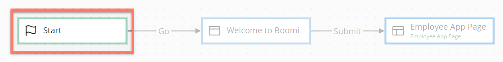

# Start map element 

<head>
  <meta name="guidename" content="Flow"/>
  <meta name="context" content="GUID-faf7525d-acdf-4125-968e-1de5227a1831"/>
</head>

The Start map element represents the beginning of your flow on the flow canvas.

The Start map element does not get rendered to an end user when a flow is run or published. It is only used as a starting point to connect to when you begin adding map elements to the flow canvas.

## Overview 

-   When you create a flow and open the flow canvas, the Start map element is already placed on the canvas.

-   Flows can only have one Start element, which cannot be deleted or duplicated.

-   Only one map element can be connected to the Start map element, using an outcome \(typically named "Go"\). Subsequent map elements can however be connected to multiple outcomes. See [Outcomes](c-flo-Outcomes_4049ee93-d7e4-4bc0-ba33-88e523bf4d89.md).

-   If you are using navigation with multiple unconnected map elements to deliver a non-sequential flow, your first map element must still connect to the Start map element.