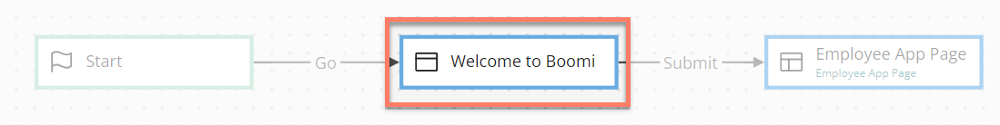
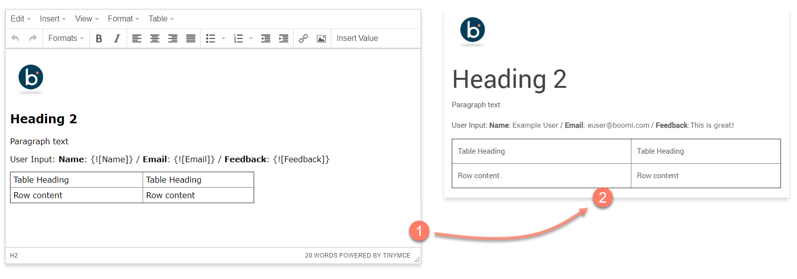

# Step map elements 

<head>
  <meta name="guidename" content="Flow"/>
  <meta name="context" content="GUID-f2f3f25f-f6c8-4f34-9c44-6210cdef30a2"/>
</head>

Step map elements are used to display content to the users of a flow by allowing simple user interfaces to be created.

A step map element can contain such as videos, images, tables, links, presentations, and code snippets.

## Overview 

Step map elements are used when you wish to present a screen to a flow user, but do not require information to be collected from them \(such as a form\), or if any complex user interaction is required. If this is required, use a page map element as this allows more complex, interactive pages to be built. See [Page map elements](c-flo-ME_Page_539c415f-59d7-47d5-90ef-cb3a108b3010.md).

Add content into a step map element using the rich-text editor provided in the **The content to be displayed to users** area. This content is then converted into HTML and displayed to a flow user when the flow is run or published.

For example, the image below shows content added into a step map element using the editor , that is then converted into HTML and displayed to a flow user when the flow is published using the default HTML5 player. 

The content editor uses the presentation component that is based on the TinyMCE HTML Editor. In addition to the standard rich-text editing functionality provided by the TinyMCE HTML Editor, the following additional functionality is available:

-   **Insert Value**: Click **Insert Value** to insert a native flow value into the content editor. The value will be inserted as a placeholder using the format `{![Value Name]}`, with this content populated with the actual value when the flow is run or published. For example, a page map element may display a form to a user to capture data into a value, with this captured information then being displayed in a step map element. See [ Values](c-flo-Values_f83f964c-1348-475d-80b1-480daef433f7.md).

-   **Insert Image**: Select **Insert \| Image** or click the **Insert Image** icon  to insert an image. When the **Insert/edit Image** form is displayed, click the **Browse** icon to select an image from the image assets that you have uploaded to your asset library. See [ Assets](c-flo-Assets_7d21c82d-c700-437d-bdaa-ae4b0716726b.md).

## Adding an outcome 

Outcomes can be added to a step map element.

-   [Adding Outcomes to a map element](c-flo-Config_Outcomes_d524e869-12d3-4f1f-b671-84872998773f.md)

## Adding a navigation override 

Navigation overrides can be added to a step map element.

-   [Configuring Navigation Override on a map element](c-flo-Config_Nav_Override_69de98e7-e100-4957-a865-2a2d76ffdb90.md)

## Adding feedback to a map element 

Feedback can be added to a step map element.

-   [Adding Feedback to a map element](c-flo-Config_Feedback_1240ae6b-af20-4eee-b5b4-5e172926c4a4.md)

## Adding comments to a map element 

Comments can be added to a step map element.

-   [Adding Comments to a map element](c-flo-Config_Comments_647ce9d6-5c9e-4e27-aa29-1a69732957a5.md)