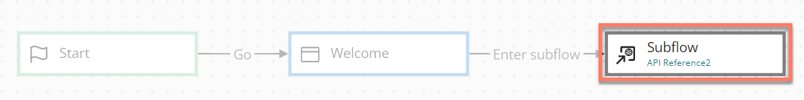

# Subflow map elements 

<head>
  <meta name="guidename" content="Flow"/>
  <meta name="context" content="GUID-3ab11267-89f8-4b36-afe8-1be36e1c4cef"/>
</head>

Subflow map elements can be added to a flow to call another flow as a 'subflow'.

## Overview 

-   Adding a subflow map element to a flow allows you to call another flow. When the subflow map element is reached in the flow, the content of the referenced subflow is inserted wherever the subflow map element is located in the flow.

-   A return map element can then be added in the child flow to return a user back to the master flow. See [Return map elements](c-flo-ME_Return_d54ca14f-ff8b-43a6-af0b-db0174ad22df.md).

-   To learn more about using subflows, see [Subflows](c-flo-Subflows_ca879fac-5941-44d3-87df-69b97ac5c034.md).

## Adding comments to a map element 

Comments can be added to a subflow map element.

-   [Adding Comments to a map element](c-flo-Config_Comments_647ce9d6-5c9e-4e27-aa29-1a69732957a5.md)