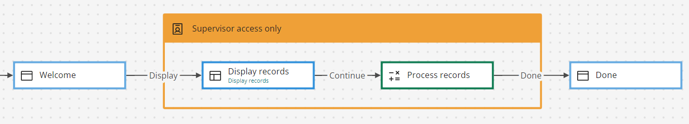

# Swimlane elements 

<head>
  <meta name="guidename" content="Flow"/>
  <meta name="context" content="GUID-872bacc3-8123-4bfa-9b87-8bc3ee9d8beb"/>
</head>

Swimlane elements are used to group and restrict access to elements in a flow application for specific users and groups requiring different authorization privileges. For example, you could create an 'employee' swimlane and a 'manager' swimlane for a flow application that approves expense submissions.

## Overview 

Swimlanes allow you to apply authorization restrictions to parts of your flow, defining who has access at either a group or user level within the flow itself. You will need to have set up an authorization in your tenant that can be used to authenticate groups/users, such as the Azure AD, Okta, Salesforce ,​ or any Security Assertion Markup Language \(SAML\) based authentication connector​.

-   The swimlane element acts as a container on the flow canvas for the part of the flow that you wish to restrict​.

-   If a user progresses through a flow into a map element contained within a swimlane, the user is challenged for authentication by the selected identity connector.

-   Multiple swimlanes can be used in a flow, allowing you to apply authorization to different parts of the flow.

-   Swimlanes are usually set up to restrict access to certain parts of a flow, but you can also apply authorization to the launch of the entire flow. This is configured when creating a new flow or when editing the properties of an existing flow. See [Flow Properties](c-flo-Flow_Properties_b74d944d-9fec-43da-9ae3-fe0a5a370d00.md).

## Notes on using swimlanes 

-   You must create a swimlane first and then drag map elements within it - if you drop a swimlane on top of map elements in the flow canvas the swimlane authentication will not be applied, even though it may look correct on the flow canvas.

-   If you move a swimlane, all the contained map elements should move with it as well - this is the easiest way to check if a map element is correctly contained within a swimlane.

-   When dragging a map element into a swimlane, the border of the swimlane element changes to green to indicate that the map element will be placed correctly within the swimlane.

-   Best practice is to create your map elements first, then add a swimlane to the canvas, and drag the elements into the swimlane.

-   A swimlane will not work if it is the first element in a flow connected to the start map element.

-   When deleting a swimlane, a table is displayed that shows the contained map elements, swimlanes, and outcomes that will also be deleted.

## Adding a swimlane to the flow canvas 

To add a swimlane to the flow canvas:

1.  Drag a swimlane element onto the flow canvas.
2.  The configuration panel for the swimlane is displayed to allow you to configure the swimlane. See swimlane configuration options below.
3.  Click **Save**.
4.  Drag the subset of map elements that you wish to protect into the swimlane on the canvas. You can resize the swimlane by dragging the container corners to expand or reduce the swimlane area.
5.  Run your flow to check your authentication is working correctly. See [Running a flow](c-flo-Running_flows_5b0b848d-2528-4a14-b186-e393812b4664.md).

## Swimlane configuration options 

The swimlane configuration options are as follows:

-   **Name**: Enter a name for the swimlane.

-   **Which Connector will users authenticate with?**: Select the you wish to use for authentication from the installed in your tenant.

-   **What type of user authentication should be used?**: Define the type of access for the swimlane:

    -   **Anyone can run this flow**: Select this option to make the swimlane 'public', i.e. anyone with the flow URL can run the flow, including any parts of the flow protected by the swimlane.

    -   **Any user that can login with the selected identity connector can run this flow**: Users of any part of the flow protected by the swimlane will be prompted to authenticate themselves before they can continue using the flow, using the authentication connector you have selected.

    -   **Create restrictions for specific users and groups of users**: Restrict access to specific users or groups for any part of the flow protected by the swimlane. For example, only a user that logs in with user@boomi.com will be able to access the parts of the flow protected by the swimlane. Anyone else not specified will be unable to access the flow, even if they can authenticate correctly with the selected identity connector.

        If this option is selected, the **Groups** and **Users** sections of the **Advanced** configuration options are enabled, allowing you to add these specific groups and users \(see below\).

-   **Social feed for collaboration**: Define whether a social feed is to be integrated with the flow:

    -   **None**: Select this option if a social feed is not required for the flow.

    -   **Display a social feed**: Select this option if you wish to display a social feed via the flow, for example, Chatter with Salesforce. Note that if using Chatter, your flow would need to use a Salesforce for authentication \(i.e. it cannot be a public flow using the default identity connector\).

-   **Groups/Users:** If you have selected an authentication connector to use with the swimlane and the **Create restrictions for specific users and groups of users** option, you can add the users/groups that you wish to restrict access to in these sections. The users/groups you add will only be able to access the parts of the flow protected by the swimlane.

    To add groups:

    1.  Click in the **Search to add groups** field in the **Groups** section and begin entering the name of any groups that you wish to add.
    2.  The search automatically returns any groups matching your search term. Select the checkbox for each group that you wish to add and click **Add Selected**.
    To add users:

    1.  Click in the **Search to add users** field in the **Users** section and begin entering the name of any users that you wish to add.
    2.  The search automatically returns any users matching your search term. Select the checkbox for each user that you wish to add and click **Add Selected**.
    Click the **Delete** icon in the **Actions** column to remove a group or user.

    **Note:** A maximum of 10 groups or users is returned by the search at any one time. If more than 10 groups or users are found that match the search term you have entered, you are notified that there are additional items, and that you should further refine your search.

-   **Comments about this Swimlane:** Add comments to the swimlane to record useful information. See [Adding Comments to a map element](c-flo-Config_Comments_647ce9d6-5c9e-4e27-aa29-1a69732957a5.md).