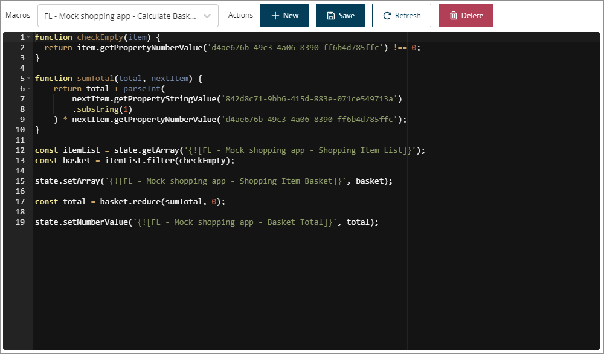

# Macros

<head>
  <meta name="guidename" content="Flow"/>
  <meta name="context" content="GUID-b108573d-8668-4d4f-aab3-79fb49adcc3f"/>
</head>

You can use macros to run JavaScript code within your flows.

Macros are created and managed on the **Macros** page.

-   The **Macros** page displays all the macros currently set up within the tenant. See [Macros page](c-flo-Macros_page_fa11bad4-4386-40bf-82af-2ec14882daed.md)

-   Create macros to execute JavaScript from within your flows **only** when map elements do not provide sufficent funtionality to achieve your outcomes. For example, you could use a macro to perform complex calculations on numeric values within a flow. See [Creating a macro](t-flo-Macros_Create_d9a4204a-2de1-454d-959a-a09929e1de23.md).

-   You can insert a macro into your flows using the **Operator** map element.

-   Macros are shared elements that can be imported into and used in multiple flows in a tenant. See [Importing a macro into a flow](t-flo-Macros_Importing_cc298b43-6f46-476d-8af9-27f33d4fc6e7.md).

-   Macros are not executed in the browser; they are executed on the server, inside the flow runtime engine, as flows support clients that may not be a browser with support for JavaScript \(such as server-to-server communication, SMS interactions, phone calls and so on\).

    This means that flows support only a subset of JavaScript \(ES5\), excluding I/O and network functions like console.log, fs or fetch, or functions that interact with the DOM such as alert and getElementById. As such, or custom components should be used for interacting with libraries or asynchronous call outside of the Boomi Flow environment. See [Supported macro JavaScript methods](r-flo-Macros_Javascript_Methods_b705e1cf-a86d-44b8-a44e-5ac692c477e0.md).