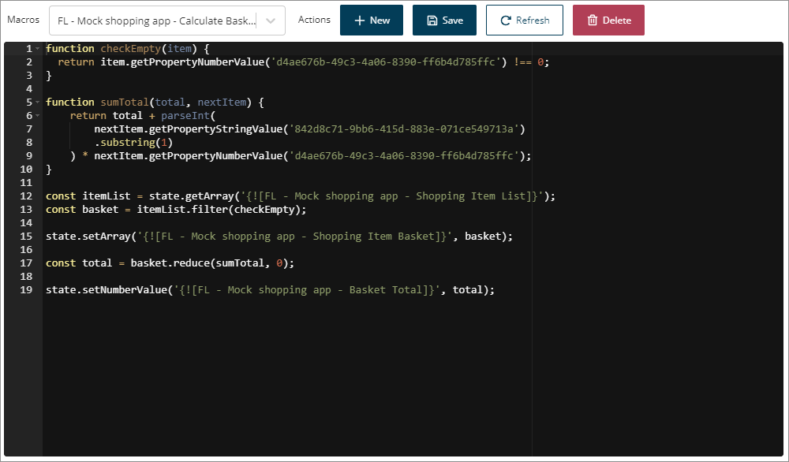

# Macros page

<head>
  <meta name="guidename" content="Flow"/>
  <meta name="context" content="GUID-fa11bad4-4386-40bf-82af-2ec14882daed"/>
</head>

Manage existing macros and create new macros on the **Macros** page.

## Opening the page

-   Select **Macros** from the left-hand menu.

## Page overview

The **Macros** page allows you to access and edit your existing macros, as well as create new macros.

-   The **Macro selection** drop-down menu allows you to select any of your existing players.

-   Once you have selected a macro in the drop-down, you can edit it and save your changes by clicking the **Save** button, delete the macro by clicking the **Delete** button, or create a new macro by clicking the **New** button. See [Creating a macro](t-flo-Macros_Create_d9a4204a-2de1-454d-959a-a09929e1de23.md).

-   Once you have selected a macro in the drop-down, the code for the macro is displayed in the main window, allowing you to directly edit the macro. See [Editing a macro](t-flo-Macros_Edit_2df8bb90-8f95-40fc-8d3e-985d536a9755.md) and [Supported macro JavaScript methods](r-flo-Macros_Javascript_Methods_b705e1cf-a86d-44b8-a44e-5ac692c477e0.md).