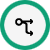
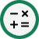
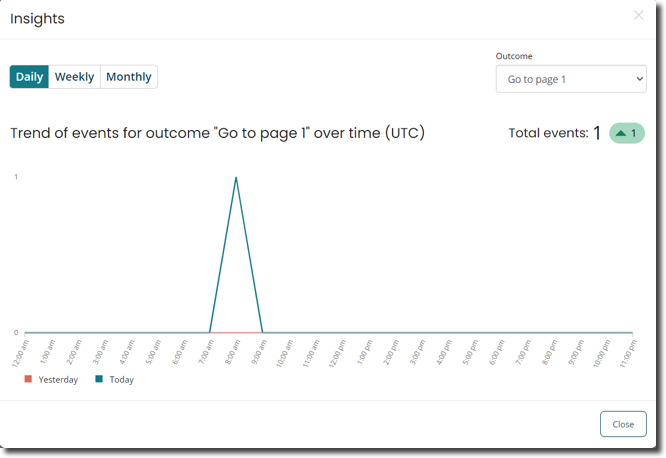
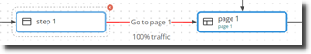

# Map elements 

<head>
  <meta name="guidename" content="Flow"/>
  <meta name="context" content="GUID-94361918-d868-4422-9bd4-94da7c46cd0f"/>
</head>

Map elements are added to the flow canvas to define the workflow and behaviour of a flow.

## Overview 

Drag-and-drop map elements from the left-hand menu onto the canvas, and join them to other map elements to form your application workflow. Map elements can be thought of as the 'building blocks' that make up a flow on the canvas; each map element provides access to a different feature that can be added into a flow, such as showing a screen to a user, obtaining user input, updating and manipulating data, and so on.

Connecting map elements with outcomes allows you to determine the path \(or paths\) that a flow will take. See [Outcomes](c-flo-Outcomes_4049ee93-d7e4-4bc0-ba33-88e523bf4d89.md).

For example, adding a step map element into a flow can display a page to a user when published as a web application, and adding a database load map element allows data from an external database to be loaded into the flow.

## Map elements 

The following map elements are available on the flow canvas. See [Using the flow canvas](c-flo-Flow_Canvas_Using_9563eda3-a577-46d0-a444-7cada7c9413d.md).

| Icon | Name | Description |
|------|------|-------------|
|  | [Start](c-flo-ME_Start_faf7525d-acdf-4125-968e-1de5227a1831.md) | The Start map element represents the beginning of your flow on the flow canvas. |
|  | [Step](c-flo-ME_Step_f2f3f25f-f6c8-4f34-9c44-6210cdef30a2.md) | Step map elements are used to present content to the users of a flow by allowing simple user interfaces to be created. A step map element can contain videos, images, tables, links, presentations, and code snippets. |
|  | [Page](c-flo-ME_Page_539c415f-59d7-47d5-90ef-cb3a108b3010.md) | Page map elements are similar to step map elements in that they are used to present content to the users of a flow, however page map elements allow for more complex, interactive pages to be built. Page layout templates are used to define the actual structure and functionality of the page. |
|  | [Modal](c-flo-ME_modal_17f92e0b-08e4-47f1-bf7f-19af4ddb7d33.md) | You can use modal map elements to open content in a modal-type browser window. |
|  | [Wait](flo-ME-Wait_24d8b1a1-2f6e-4a55-821a-26c6928b2432.md) | Wait map elements are used to pause the execution of a flow for a set amount of time. When a user running a flow reaches a wait map element, the flow is paused, and a screen/message displayed to the user for the duration that is set in the wait map element. Once this time period has elapsed, the flow continues running, progressing to the next map element in the flow. |
|  | [Decision](c-flo-ME_Decision_9ca6d47d-cb8f-40dd-8514-381dca308957.md) | Decision map elements allow conditional routing within a flow, for example where one incoming path gets split into two or more outgoing paths, based on pre-conditions. This is achieved using outcomes and business rules within a flow. |
|  | [Operator](c-flo-ME_Operator_7d40c8c0-1da1-4acc-a659-18e534029ae6.md) | Operator map elements allow the state of a value to be changed, using standard operations (such as adding two values, emptying a value) or by using macro operations to perform more sophisticated operations (such as calculating a percentage, random number assignments, and so on). |
|  | [Message](c-flo-ME_Message_342e9efb-0f11-4083-a2dc-195d52d1f939.md) | Message map elements allow the sending and receiving of requests to third-party messaging connectors. These can be used to configure both incoming and outgoing messages. |
|  | [Database Load](c-flo-ME_Load_d47f5e01-a760-4aa2-8342-e843dd3abc48.md) | Database load map elements allow data to be loaded from an external data source into a flow, such as from a database. |
|  | [Database Save](c-flo-ME_Save_bffa5a42-8d81-4dd9-9528-1eb26ae04d4c.md) | Database save map elements allow data to be saved to an external data source from a flow, such as to a database. |
|  | [Database Delete](c-flo-ME_Delete_3488f656-867a-426f-911a-54b620716d0d.md) | Database delete map elements allow data to be deleted in an external data source from a flow, such as data in a database. |
|  | [Swimlane](c-flo-ME_Swimlane_872bacc3-8123-4bfa-9b87-8bc3ee9d8beb.md) | Swimlane elements are used to group and restrict access to elements in a flow application, for specific users and groups that require different authorization privileges. For example, you could create an "employee" swimlane and a "manager" swimlane for a flow application that approves expense submissions. |
|  | [Group](flo-ME-Group_790eaab4-9dd6-4081-a199-9f2fe46a9302.md) | Group elements allow you to organize multiple elements on the flow canvas into a single group, which can then be moved and positioned as a single canvas element. |
|  | [Subflow](c-flo-ME_Subflow_3ab11267-89f8-4b36-afe8-1be36e1c4cef.md) | Subflow map elements can be added to a flow to call another flow as a child subflow. See [Subflows](c-flo-Subflows_ca879fac-5941-44d3-87df-69b97ac5c034.md). |
|  | [Return](c-flo-ME_Return_d54ca14f-ff8b-43a6-af0b-db0174ad22df.md) | Return map elements are used in a subflow to indicate that the parent flow process should be rejoined from the subflow. See [Subflows](c-flo-Subflows_ca879fac-5941-44d3-87df-69b97ac5c034.md). |
|  | [Note](flo-ME-Note_aa993c3a-9c61-45a2-b392-c59aae58199d.md) | Note map elements allow you to add notes directly to the flow canvas, to provide information about the flow. |

## Map element configuration options 

When a map element is added to the flow canvas, a configuration panel opens that allows you to define a number of additional configuration options for the map element. For example, all map elements allow you to add comments, but only some will allow you to add outcomes directly in the configuration panel. See [Map element configuration options](c-flo-Config_1441f950-cffa-4155-b9b9-3149aa30fa52.md).

## Map element metadata 
Map elements of a flow are converted into JSON formatted metadata, which can be viewed and edited if required. See [Map element metadata](c-flo-ME_Metadata_b3d64956-567e-4dbc-92b9-3f174004d5ba.md).

## Map element ID 
Every map element has a unique ID and version ID. The unique ID remains the same throughout the life cycle of the flow; the version ID changes every time the map element is modified.

When a flow snapshot is created, the build process takes the latest version of all map elements associated with the flow, and locks the flow to those versions of the elements. A flow references all of the map elements that are needed for it to run.

## Insights and Traffic Ratio

**View Insights**: This option gives you the capability to visualize outcome clicks through an easy-to-read chart. You can compare these clicks against the preceding day, week, or month which is useful for monitoring the impact of changes made to the flow.

You can change the time period to either daily, weekly, or monthly. You can also change the outcome using the select box at the top right side.

**View Traffic Ratio**: You can view the ratio of traffic for the current month distributed across all outcomes that exit the map element. The depiction of the percentage value is displayed underneath the outcome label.

## Business rules

Business rules allow you to define different outcomes or actions based on whether the conditions specified in the rule have been met. Business rules are typically applied in a flow to determine which path a flow should take if there are multiple outcomes available, but can also be implemented on a user interface, data, or validation. See [Business rules](c-flo-Canvas_Business_Rules_e8860ab5-4260-449c-b72d-137d9902baec.md).