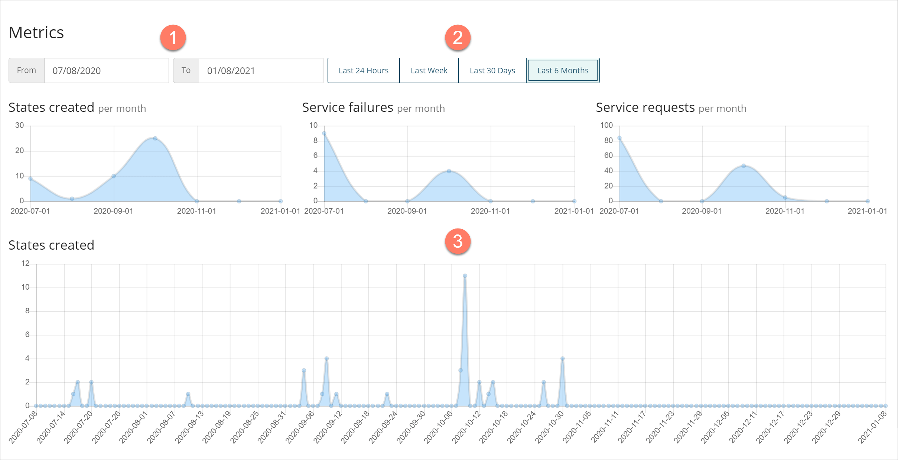

# Metrics page

<head>
  <meta name="guidename" content="Flow"/>
  <meta name="context" content="GUID-5b8a4279-bf91-48dc-9dfe-adc9ba799bac"/>
</head>

The **Metrics** page allows you to view performance measurement data about the flows in your tenant.

## Opening the page

-   Select **Metrics** from the left-hand menu.

## Page overview

-   You can filter the data displayed for all metrics by entering a date range into the **From** and **To** fields. Only data for the specific date range will be shown. 

-   Alternatively, click on any of the date range buttons to quickly filter metrics data. 

    -   **Last 24 Hours**: Display data from the last 24 hours only.

    -   **Last Week**: Display data from the previous 7 days only.

    -   **Last 30 days**: Display data from the previous 30 days only.

    -   **Last 6 Months**: Display data from the previous 6 months only.

-   Metrics are displayed across the rest of the page as graphs or as tables.  Hover over node points or pie segments in a graph to view information about that data point. See [Understanding metrics](c-flo-Metrics_Understanding_64d06124-ae99-4c54-b3c2-2c9a67701222.md).