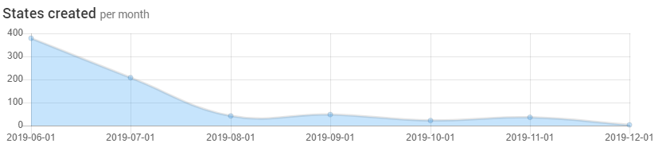
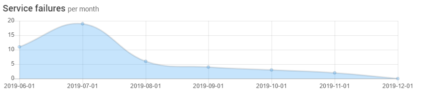
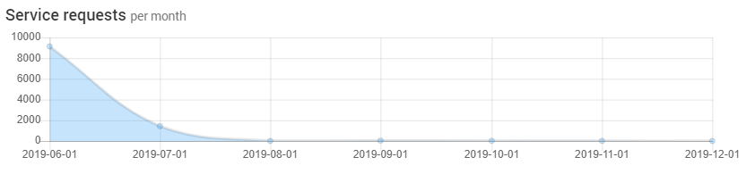
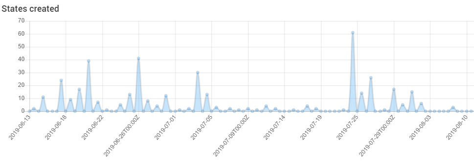
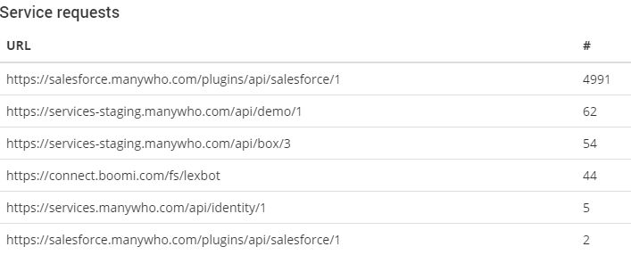
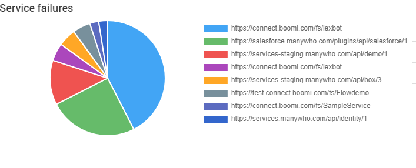

# Understanding metrics

<head>
  <meta name="guidename" content="Flow"/>
  <meta name="context" content="GUID-64d06124-ae99-4c54-b3c2-2c9a67701222"/>
</head>

The metrics available on the **Metrics** page can help you understand how the flows in your tenant are performing.

The following metrics are displayed:

-   [States created per month](#section_eqc_lnt_bkb)

-   [Service failures per month](#section_yxl_nnt_bkb)

-   [Service requests per month](#section_trj_4nt_bkb)

-   [States created](#section_cb3_pnt_bkb)

-   [Service requests](#section_hsw_pnt_bkb)

-   [Service failures](#section_h45_qnt_bkb)

## States created per month

A data graph showing the total number of states created per month for all flows within the tenant. This data is most useful when the **Last Six Months** date range is selected as it provides a monthly usage trend view for your flows. See [Flow states](c-flo-Flows_Flow_States_32129a7c-a51a-4566-a406-3a66906818c6.md).

## Service failures per month

A data graph showing the total number of recorded service failures per month within the tenant. A service failure is recorded when a request made to a service fails. See [c-flo-Service\_Integrations\_cac4d712-9607-4f24-8e70-aae48ceb27b9.md](c-flo-Service_Integrations_cac4d712-9607-4f24-8e70-aae48ceb27b9.md).

You can obtain more detailed information on service failures in your flows using the **API Tool** and the GET /api/service/1/requests endpoint. See [API tool](c-flo-APItool_95ad682d-ce04-494a-9235-e113a89406bc.md).

## Service requests per month

A data graph showing the total number of recorded service requests per month within the tenant. This includes service requests that failed as well as all successful service requests. See [c-flo-Service\_Integrations\_cac4d712-9607-4f24-8e70-aae48ceb27b9.md](c-flo-Service_Integrations_cac4d712-9607-4f24-8e70-aae48ceb27b9.md).

You can obtain more detailed information on service failures in your flows using the **API Tool** and the GET /api/service/1/requests endpoint. See [API tool](c-flo-APItool_95ad682d-ce04-494a-9235-e113a89406bc.md).

## States created

A data graph showing the number of states created for all flows within the tenant for the selected date range. This provides a more granular view of created states than the **States created per month** metric, allowing you to view how many states were created on a specific day for example.

## Service requests

A data table showing all the service requests made within the tenant for the selected date range, grouped by individual service. The specific url for each service is shown in the **URL** column, along with the total number of requests made in the **\#** column.

You can obtain more detailed information on service requests in your flows using the **API Tool** and the GET /api/service/1/requests endpoint. See [API tool](c-flo-APItool_95ad682d-ce04-494a-9235-e113a89406bc.md).

## Service failures

A pie chart showing all the service failures recorded within the tenant for the selected date range,grouped by individual service. The segments in the chart represent each individual service.

You can obtain more detailed information on service failures in your flows using the **API Tool** and the GET /api/service/1/requests endpoint. See [API tool](c-flo-APItool_95ad682d-ce04-494a-9235-e113a89406bc.md).