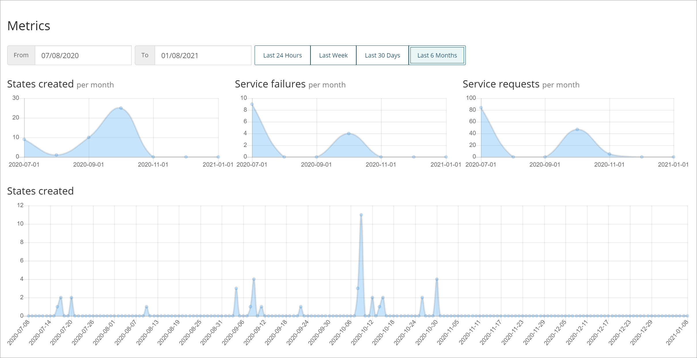

# Metrics

<head>
  <meta name="guidename" content="Flow"/>
  <meta name="context" content="GUID-e4a7338d-a32b-4697-b6ae-58a55a39ae58"/>
</head>

Metrics provide performance measurement data about the flows in your tenant, such as states created and service requests/failures.

These metrics help you to track and assess the performance of your flows.

-   Metrics are displayed on the **Metrics** page. See [Metrics page](c-flo-Metrics_Page_5b8a4279-bf91-48dc-9dfe-adc9ba799bac.md).

-   The different metrics help to provide visibility into your tenant performance, presenting useful data as a series of graphs or as a table. See [Understanding metrics](c-flo-Metrics_Understanding_64d06124-ae99-4c54-b3c2-2c9a67701222.md).