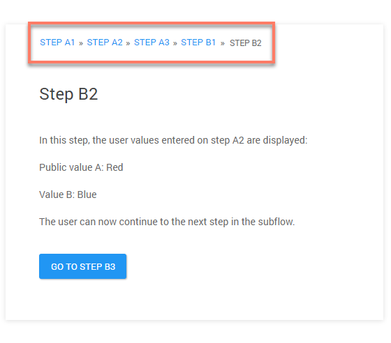
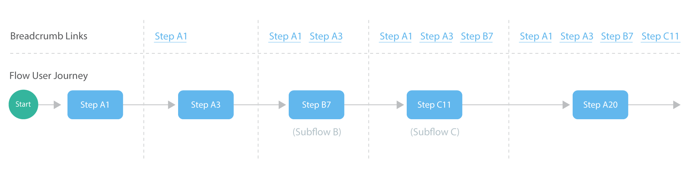
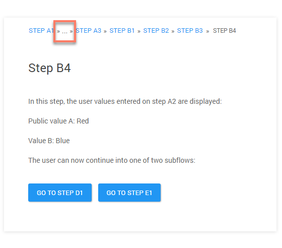
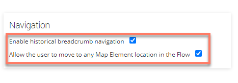
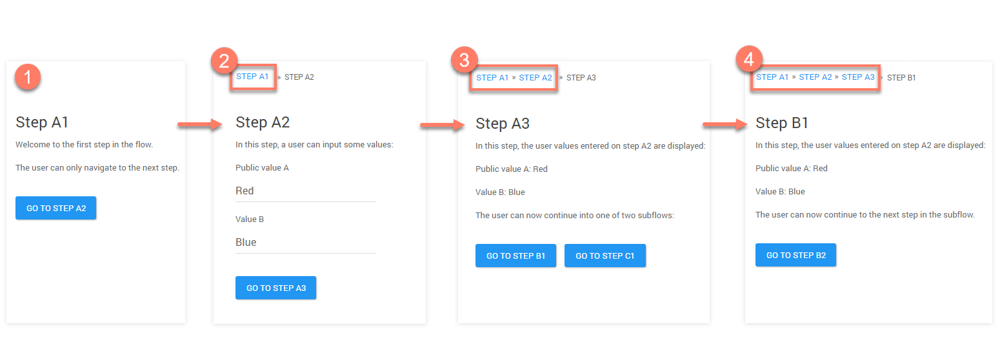

# Historical navigation

<head>
  <meta name="guidename" content="Flow"/>
  <meta name="context" content="GUID-d63d245e-098d-4bd4-aa7e-fd3d937a33ba"/>
</head>


Historical navigation can be added to a flow to allow users to navigate to previously visited pages in the flow.

If historical navigation is enabled, breadcrumb-style navigation links are inserted at the top of the flow, enabling users to quickly navigate back through their flow page history to previously visited pages.



A new link is added to the breadcrumb navigation each time a user clicks on an outcome to navigate to the next location in the flow path, such as the next map element in the flow, or to another map element in a subflow. In this way, the breadcrumb links trail is built up as the user navigates forward through the flow. The last item in the breadcrumb trail displays the name of the element the user is currently on.



Once a user has proceeded beyond five steps in the flow, the breadcrumb navigation is collapsed so that only five links are shown, with an ellipsis displayed between the links. Clicking on the ellipsis displays the full set of breadcrumb links.



## Enabling historical navigation

Historical navigation only needs to be enabled on the top-level parent flow \(if using subflows\); it does not need to be enabled on each child subflow.

1.  On the main **Flows** page, click **Edit Flow** on the parent flow tile that you wish to enable historical navigation for.
2.  On the flow canvas, click **Flow Properties** from the right-hand menu. The **Flow Properties** form is displayed.
3.  In the **Navigation** section, select the following two checkboxes to enable historical navigation:

    

    -   **Enable historical breadcrumb navigation**: Select this checkbox to enable historical navigation.

    -   **Allow the user to move to any Map Element location in the Flow**: This checkbox is also required for historical breadcrumb navigation, although it controls wider navigation functionality within a flow. This checkbox allows you to specify user navigation behaviour for a flow; selecting the checkbox enables a user to navigate to any map element location when using a flow, allowing a user to freely jump around between pages. This setting is typically enabled when navigation is used in a flow.

4.  Click **Save** to save and apply your changes. When the parent flow is run, historical navigation is displayed.

## Notes on using historical navigation

-   Flow state data is saved as the user progresses, so that if the user navigates back to a previous step using the breadcrumb links, the state data is retained.

-   The name displayed in the breadcrumb link is taken from the map element **Name** property.

-   Only the step and page 'user interface' map elements are displayed in the navigation as breadcrumb links.

-   Swimlane authorization and access is applied to map elements as normal, for example, if a user is not authorized to view a page, this is reflected in the navigation.


## Subflows and historical navigation

Historical navigation allows a user to navigate in and out of subflows \(as in the worked example below\), but value passing behaviour should be noted.

-   When passing values back and forth between parent flows and subflows, public values are not restored to the value state recorded at the point when a user jumps away from and back to a page using the navigation. This is because public values will always use the latest 'current' value; all other values are restored to the original navigation state.

-   This only affects backwards navigation performed using the breadcrumb links, forward movement through the parent flow and subflow\(s\) is unaffected.


This default value restoration behaviour can be modified by editing metadata on **Subflow** and **Return** map elements. To learn more about editing metadata on map elements, see [Metadata](c-flo-ME_Metadata_b3d64956-567e-4dbc-92b9-3f174004d5ba.md).

-   restoreValuesOnJump: This metadata setting is set to 'true' by default on **Subflow** map elements. Set this to 'false' to modify value restoration behaviour so that values are passed as if the historical navigation had not been used, i.e. values are not restored automatically.

    ```
    "subflow": {
          "restoreValuesOnJump": false
    },
    ```

-   returnValuesOnJump: This metadata setting is set to 'false' by default on **Return** map elements. Set this to 'true' to modify value restoration behaviour so that values are passed as if the historical navigation had not been used, i.e. values are not restored automatically.

    ```
    "subflow": {
          "returnValuesOnJump": true
        },
    ```


## A worked example - using historical navigation

This example illustrates a simple historical navigation scenario.



-   Step A1 begins the flow. The breadcrumb trail is empty as there is no user path history yet. 

-   The user proceeds to Step A2.  The breadcrumb trail now begins to display the user path history, and a link to the previously visited page is displayed, allowing the user to jump back to step A1.

-   The user proceeds to Step A3.  The breadcrumb trail is built up further, displaying the previously visited pages, allowing the user to jump back to step A1 or step A2.

-   The user proceeds to Step B1, entering a subflow.  The breadcrumb trail continues to build, displaying the previously visited pages, allowing the user to jump back to step A1, step A2 or step A3. The user proceeds to Step B2 in the subflow.