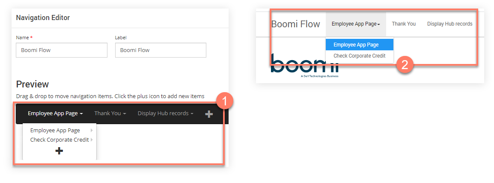
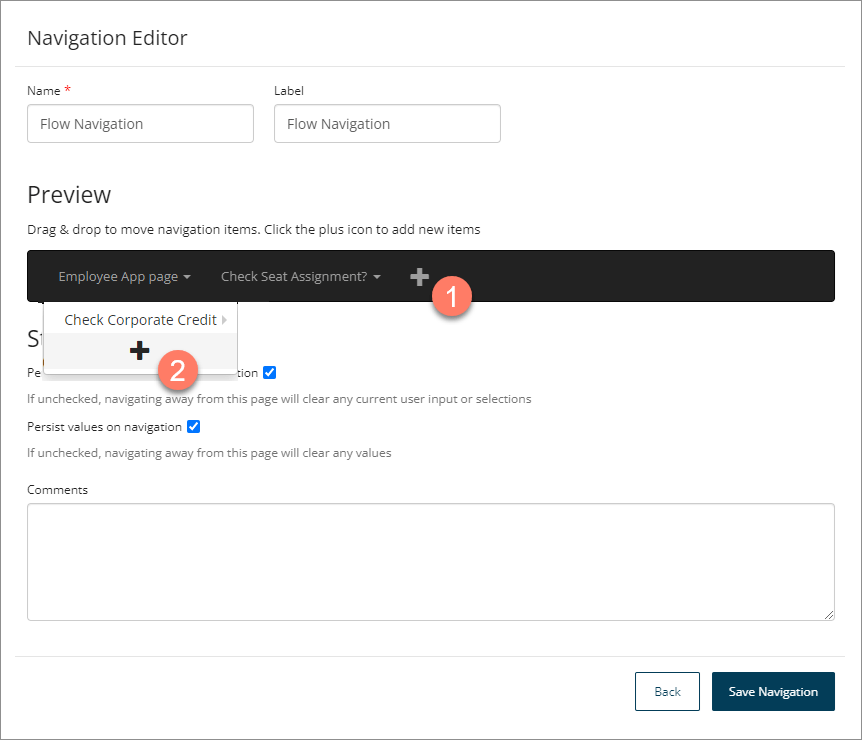
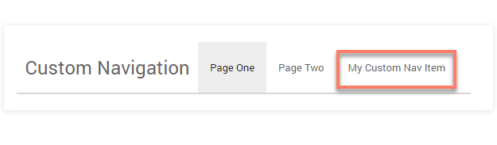

# Navigation 

<head>
  <meta name="guidename" content="Flow"/>
  <meta name="context" content="GUID-871ceb19-15cf-4fe6-bc34-7e07acbf5878"/>
</head>


You can add a navigation element to a flow to allow non-sequential navigation within a flow, allowing flow control to pass from one element to another without waiting for a previous element to be executed.

## Overview 

A navigation element allows you to build a nested hierarchical menu that allows flow users to navigate to a specific map element \(such as a page\) from anywhere within a flow. When the user selects the menu item, the flow executes the linked map element.

For example:



-   A navigation element is added in a flow, containing a top-level menu and a sub-menu on the Employee App Page menu item. Each item links to a page map element in the flow. 

-   When the flow is published as a web application using the default player, the navigation element shows as a fixed navigation menu at the top of the page. 

    When the user selects a menu item from the navigation bar, they are taken to the relevant page in the flow.


**Note:** You can also change the navigation and hierarchy of menu items by applying a navigation override setting for individual map elements on the flow canvas. This allows you to hide/disable an entire navigation bar or menu items from a user. See [Configuring Navigation Override on a map element](c-flo-Config_Nav_Override_69de98e7-e100-4957-a865-2a2d76ffdb90.md).

## Adding and configuring a navigation element 

To add a navigation element to a flow:

1.  Select **Navigation** from the right-hand menu on the flow canvas.
2.  The **Navigations** form is displayed. Any navigation elements you have set up for the flow are displayed and can be edited or deleted as required. Click **New Navigation**.
3.  The **Navigation Editor** is displayed.

    

4.  **Name**: Enter a name for the navigation element.
5.  **Label**: Enter a label for the navigation element. This will be displayed as a heading to the left of the navigation bar.
6.  Add top-level menu items as follows:

    1.  Click the **Plus** icon to add a new top-level menu item. 
    2.  Select the map element to link the menu item to from the **Navigate To** drop-down menu.

        Instead of navigating to a map element, you can select the "URL" option to open a URL. Select or create a string value with the **URL** that you want to open when the menu item is selected, and select whether to open the URL in the same or a new browser tab, from the **URL Target** drop-down menu.

    3.  Enter a label in the **Label** field. This text is shown on the menu item in the navigation bar.
    4.  Click **Save** to save the new menu item and add it to the navigation bar. The **Preview** area will update to show the new menu layout.
    5.  Add further top-level menu items as required.
7.  Add nested sub-menu items as follows:
    1.  Hover over an existing menu item and click the **Plus** icon to add a nested menu item within it. 
    2.  Select the map element to link the sub-menu item to from the **Navigate To** drop-down menu.
    3.  Enter a label in the **Label** field; this is what will be displayed on the sub-menu item.
    4.  Click **Save** to save the new sub-menu item and add it as a nested menu item. The **Preview** area will update to show the new menu layout. Hover over the top-level menu item to show the new sub-menu item.
    5.  Add further sub-menu items as required. You can also add sub-menu items to other sub-menu items to create a hierarchy of nested menus.
8.  **Persist input/selection data on navigation**: Define whether user input/selection state data is saved when navigating away from a page. This feature is useful in scenarios where performance improvements need to be made due to large amounts of state data being present on a page that may negatively impact performance when navigating.

    -   If selected \(default\), all state data such as user input and selections is saved when navigating away from the page.

    -   If this setting is not selected, any current user input or selection state data is cleared when a user navigates away from the page.

9.  **Persist values on navigation**: Define whether all values are cleared when navigating away from a page.

    -   If selected \(default\), all valid values are passed between flows when a navigation link is used.

         :::note

         Value passing behaviour also depends on the type of value, such as when passing values between parent flows and subflows. See [ Passing values using subflows](c-flo-Subflows_passing-values_8a94d936-7c7c-4e50-8706-6652dcf1e0c9.md). When defining access for a flow, you can also use a swimlane, by selecting the Swimlane element in the canvas to build a flow that passes control between users with different privileges. For example, there may be an ’employee’ swimlane and a ‘manager’ swimlane for a flow app that approves expenses submissions. See [Swimlane elements](c-flo-ME_Swimlane_872bacc3-8123-4bfa-9b87-8bc3ee9d8beb.md).

         :::
   
    -   If this setting is not selected, all values are cleared when a user navigates away from the page using a navigation link.

10. **Comments**: Add any useful information about the navigation element.
11. Click **Save Navigation** to save the new navigation and return to the **Navigations** form. The new navigation element is displayed in the list of navigations, and can be edited or deleted as required.
12. When the flow is published as a web application, the navigation element is converted into a navigation bar that allows the user to freely navigate between map elements \(pages\) in the flow.

## Customizing the navigation element 

The default navigation bar is based on React and Bootstrap 3, which means you can customize the look and feel of the navigation bar using Bootstrap components.

For example, this can be done by adding the React components property to the `navigation` setting in a custom player.

The following line of code can be added to a player to insert a new custom navigation item:

```
navigation: { 
 isFixed: true,
 isWizard: false,
 components: [React.createElement("li", 
 null, React.createElement
 ("a", { href: "https://example.com" }, 
 "My Custom Nav Item"))]
}
```



-   The navigation element also has a number of options that can be defined in the default HTML5 player, such as whether it is fixed or uses a 'breadcrumbs' style. See [ Customizing players](c-flo-Players_HTML5_9dffba2f-c22b-4a90-8950-9dc6af119ab0.md) and [ Default legacy player options](r-flo-Players_Default_Options_8bfa7e4b-12e1-4b69-81de-40c9b40f5765.md).

-   CSS styling also allows you to customize the navigation element by overriding the main bootstrap navigation .mw-bs .navbar-nav class and sub-classes. See [ Adding CSS and Javascript to custom players](c-flo-Players_Stylesheets_ebaf21f6-277a-4a8e-8f12-e6d48c2a99be.md) and [ Navigation CSS](r-flo-CSS_Navigation_8fee82d5-854e-4327-b77f-8afeb3a62edf.md).