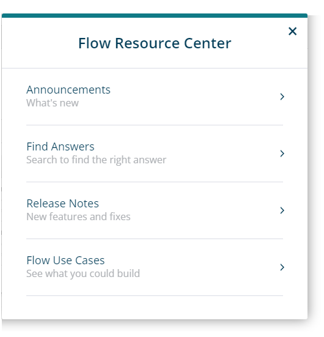

# Flow Resource Center 

<head>
  <meta name="guidename" content="Flow"/>
  <meta name="context" content="GUID-93ce52c6-9025-4e63-9f02-bc561d22c6bc"/>
</head>

The **Flow Resource Center** allows you to view Flow announcements, release notes, search for answers, and explore common Flow use cases.

## Announcements 

Click the **Announcements** heading to view the latest important Flow announcements. Announcements are ordered by date, with the latest announcements shown first.

## Find Answers 

Click the **Find Answers** heading to search the help resources.

Enter your search term, and click the search icon, to search for:

-   Boomi Enterprise Platform documentation on [help.boomi.com](http://help.boomi.com).

-   Knowledge articles in the [Boomi Community](https://community.boomi.com/s/).

-   Training content in [Boomi Training](https://train.boomi.com/).

-   Video content in the [Boomi YouTube channel](https://www.youtube.com/c/BoomiOfficial).

Relevant matching content is shown once you have performed your search. Partial search terms can be used.

-   Click the title link for any content in the search results that you wish to view. Content is opened is a new browser tab/window.

-   Click the **Filters** link to filter the content type that you wish to view results for. Click the **Filters** link again to close the filter selection and return to the search results.

## Release Notes

Click the **Release Notes** heading to view the latest Flow release notes. Release notes identify the new features and fixes released in Flow.

The full monthly release notes for the platform can be viewed in the **What's new** section on [help.boomi.com](http://help.boomi.com).

## Flow Use Cases 

Click the **Flow Uses Cases** heading to view a selection of [Boomi Community](https://community.boomi.com/s/) articles that cover useful examples of what can be achieved using Flow.