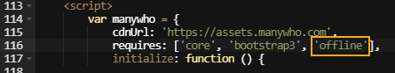
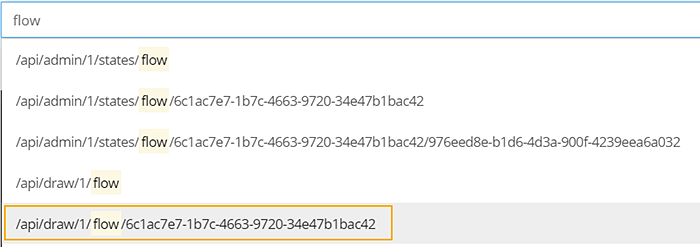
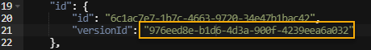
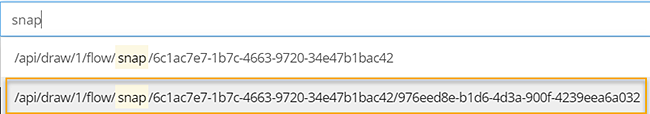
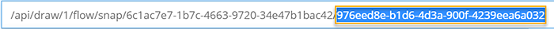
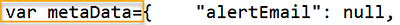
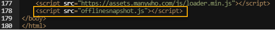

# Configuring an offline flow

<head>
  <meta name="guidename" content="Flow"/>
  <meta name="context" content="GUID-97f8fffa-7576-4682-8999-69b6f55f59ac"/>
</head>

A flow can be configured to work offline via a customized Player that loads the required offline JavaScript framework and flow snapshot data.

## Before you begin

-   When designing and configuring an offline flow, ensure the flow does not use functionality that is unsupported by offline flows. See [Offline flows supported functionality](r-flo-Offline_Supported_Functionality_29c3cd95-fc7e-42f2-ae85-902736568210.md) for more information.

-   As the offline process requires insertion of the latest active snapshot data into the custom flow player, this means each time you make changes to the flow you will need to update this snapshot data. Therefore, we recommend that you build and configure your flow online until it has been finalised, and only then perform the steps below to make the flow 'offline'. This will minimise any rework involved in having to keep updating the snapshot data every time you make changes to the flow itself.

## Step 1: Loading the offline JavaScript framework into a Player

The flow must first be configured to use the flow offline JavaScript framework via a customized Player.

1.  On the **Home** tab select **Players** from the main menu.
2.  Create a new Player or select the Player that you will be using to deliver the offline flow from the drop-down **Players** list.
3.  Add 'offline' to the **Requires** array.

    

4.  Click **Save** to save the Player.

## Step 2: Obtaining and loading the offline flow snapshot data into a Player

The Player also requires the latest snapshot data for the published offline flow. This involves obtaining the `versionid` of the flow and loading it into the Player via a JavaScript file stored in the **Assets** library.

1.  Open the flow you wish to configure as offline.
2.  On the **Home** tab select **API** from the main menu.
3.  Enter `flow` into the API **Address** field and select the automatically populated response that begins with */api/draw/1/flow/* with an id string after it.

    

4.  Click **GET**.
5.  The response pane now contains the versionid data for the flow. Copy this value as you will need it to obtain the correct snapshot in the following steps.

    

6.  Enter `snap` into the API **Address** field and select the automatically populated response that begins with */api/draw/1/flow/snap/* with an id string after it.

    

7.  Once you have this in the API **Address** field, you will now need to overwrite the id string at the end of this value with the *versionid* copied in step 5 above.

    

8.  Click **GET**.
9.  The response pane now contains the snapshot data for the offline flow. Copy all the snapshot data and paste it into a text editing tool \(for example, Notepad\).
10. Insert `var metaData=` at the very beginning of the snapshot data.

    

11. Name and save this file with a .js file extension.
12. On the **Home** tab select **Assets** from the main menu.
13. Upload the file to the **Assets** library in your tenant.
14. Once the file has been uploaded, right-click on the file and select **Copy Link Address**. Paste this into a text editing tool \(for example, Notepad\).
15. Open the Player that you customized in Step 1 and add: `<script src="paste snapshot js link here"\></script\>` immediately after the `<script src="https://assets.manywho.com/js/loader.min.js"\></script\>` tag, replacing the '*paste snapshot js link here*' text with the link address copied in the previous step. This creates a link to the snapshot JavaScript file, enabling you to easily change the snapshot data if required without editing the Player.

    

16. The flow is now configured and available to be run offline. See [Running an offline flow](c-flo-Offline_Running_Offline_Flow_519cf771-30f1-4407-bbd3-ad8d6541a913.md) for more information.

## Caution: Assets Security

Assets should **not** be considered a secure endpoint, as anyone with the link will be able to download the snapshot of the flow, which may contain sensitive information \(if you have entered a password in a value for example\).

Any values that a runtime user won’t need to view or change can be safely set to 'null' in the snapshot file, such as values used for configuration for a .

For example:

`contentValue: “secret”`

Could be changed to:

`contentValue: null`