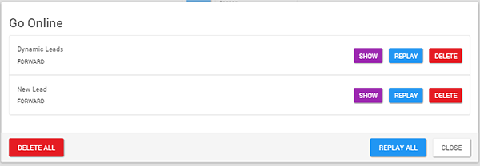
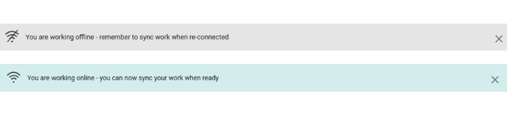

# Running an offline flow

<head>
  <meta name="guidename" content="Flow"/>
  <meta name="context" content="GUID-519cf771-30f1-4407-bbd3-ad8d6541a913"/>
</head>

Once you have published and configured an offline flow, it can be run by users 'offline'.

## Before you begin

-   Ensure that you have configured your offline flow correctly. See [Configuring an offline flow](c-flo-Offline_Creating_Offline_Flow_97f8fffa-7576-4682-8999-69b6f55f59ac.md) for more information.

## Running an offline flow - an example

1.  The user initially runs the flow in a browser when they are online. Whilst online, the offline engine will cache the data it requires to work offline.
2.  Once caching is complete, a message is displayed informing the user that the flow is ready to use offline.

    

3.  When the user then runs the flow offline \(i.e. with no internet connectivity\) it will cache the user data and a **SYNC FLOW** icon is displayed.

    

4.  When the user once again runs the flow online and clicks **SYNC FLOW**, the **Go Online** form is displayed.

    

    -   The user can now choose to replay and apply all the cached requests in sequence, replay requests out of sequence, or delete the requests entirely.

    -   Click **SHOW** to view the data contained in the data cache request.

    -   Click **REPLAY** to synchronize the data cache request to the online engine.

    -   Click **DELETE** to delete the data cache request so it will not be synchronized to the online engine.

    -   Click **DELETE ALL** to delete all the data cache requests.

    -   Click **REPLAY ALL** to synchronize all the data cache requests to the online engine.

    -   Click **CLOSE** to close the form and continue running the flow offline.

5.  The flow will then once again cache the latest metadata it requires to simulate online functionality, in preparation for running offline again.

## Network connectivity notifications

Users of an offline flow are notified when network connectivity is lost and re-gained.

-   When a flow enters an offline state, a notification is displayed to inform the user that they are working offline and should synchronize their offline work when re-connected.
-   When an offline flow enters an online state, a notification is displayed to inform the user that they are now working online and can synchronize their offline requests when required.