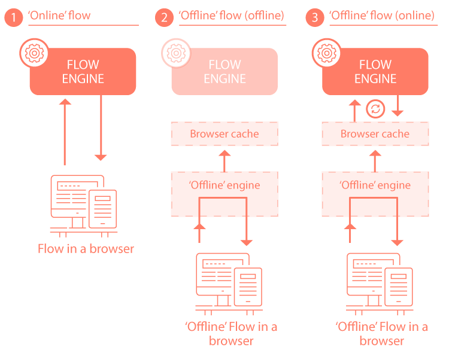

# Offline flows technical overview

<head>
  <meta name="guidename" content="Flow"/>
  <meta name="context" content="GUID-6503579d-5f7d-459c-8856-3aec14778691"/>
</head>

A technical explanation of how offline flows work in comparison to a normal online flow.

## 1. 'Online' Flow

In a normal 'online' flow, the client browser will communicate directly with the online flow engine.

## 2. 'Offline' flow \(offline\)

-   If a flow is configured to work 'offline', when it is then accessed in an 'offline' scenario \(i.e. where there is no internet connectivity\), the flow will no longer communicate with the online flow engine, but will instead switch to communicating with the offline flow engine instead.

-   It will do this by using the locally cached flow metadata in the flow snapshot to simulate online behaviour, acting as if it were communicating directly with the online flow engine itself.

-   As a user moves through the flow, the captured data is saved to a cache in the client browser.

## 3. 'Offline' flow \(online\)

-   Once the user has online connectivity again, they must decide what should happen with the cached data requests, for example whether to replay and apply all the cached requests in sequence, replay requests out of sequence, or delete the requests entirely.

-   Only once the requests have been replayed will the flow resume normal communication with the online flow engine. Until these requests have been replayed, the flow will still operate in 'offline' mode.

:::note

If the flow is protected with authentication and the user's previous session has timed out, the user will be asked to re-authenticate before they can replay and apply the cached requests.`](#).

:::
