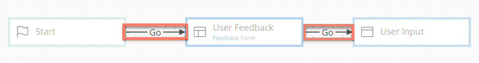
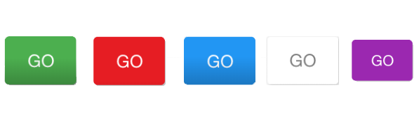

# Outcomes

<head>
  <meta name="guidename" content="Flow"/>
  <meta name="context" content="GUID-4049ee93-d7e4-4bc0-ba33-88e523bf4d89"/>
</head>

An outcome allows a flow user to move from one map element to another, or from one map element into another flow.

Outcomes connect one map element to another. All map elements on the flow canvas can have an outcome connected to them.

-   All flows begin with the Start map element, which is fixed on the flow canvas. The first outcome in a flow is the outcome that leads from the Start map element to the first map element placed on the flow canvas. This first outcome is typically named "Go". You can have only one outcome connected to the Start element – this begins your flow. See [The Start map element](c-flo-ME_Start_faf7525d-acdf-4125-968e-1de5227a1831.md).

-   Subsequent map elements can have multiple outcomes connected, and business rules can be added to these outcomes to determine the path a flow should take based on pre-determined logic. For example, if you have multiple outcomes coming from a single map element, business rules allow you to define which path a flow should take, depending on the conditions defined in the business rules. See [Business rules](c-flo-Canvas_Business_Rules_e8860ab5-4260-449c-b72d-137d9902baec.md).

-   When a flow is run or published as a web application, outcomes are converted into clickable buttons. Some map elements \(such as database load or database save that handle backend database actions and so are not visible in a flow to a user\) are not converted to buttons, but **must** still be connected using outcomes.

-   Map elements can have an outcome connecting both to and from the same two map elements. A simple use case for this would be Previous/Next buttons between two pages in a flow.

-   If you are using navigation in a flow to provide non-linear access to map elements at any point within a flow, not all the map elements in the flow canvas need to be connected using outcomes. For example, you can have a flow web application that contains unconnected map elements, with these elements made available to a user through a navigation bar. See [Navigation](c-flo-Navigation_871ceb19-15cf-4fe6-bc34-7e07acbf5878.md).

-   Outcomes can also be set as fault outcomes, to provide greater error handling options within a flow. If an error occurs during a call to an external connector, such as on a message map element, the flow will automatically be routed along this fault outcome path. This outcome could route to a specific error handling section, subflow or integration process.

-   You can add browser Back button functionality to a flow, by setting an outcome to a “Back” action.

    1.  Add or edit an outcome on the flow canvas, and select “Back” from the **What kind of action is this?** drop-down menu.
    2.  When the flow is run in a browser, using the browser Back button triggers the Back outcome, directing the flow back along the outcome path you have defined. For example, you could add an outcome to the previous map element or step in the flow, and set this to be a Back outcome.
    If you have multiple Back outcomes set on a map element, the back outcome that is highest in outcome order on the map element is used. For example, if you have two Back outcomes on a map element, the Back outcome with an Order of “0” is used, instead of the Back outcome with an Order of “1”.

## Adding an outcome

1.  Add an outcome to a map element. You can add outcomes to map elements either directly on the flow canvas or on the map element configuration panel.
    -   To add an outcome on the flow canvas, see [Joining map elements with outcomes on the flow canvas](c-flo-Canvas_Joining_Elements_dfc06eea-8adf-4baa-a35e-4e8a3d3b1e75.md).

    -   To add an outcome on the map element configuration panel, click **New Outcome** in the **Outcomes** section.

2.  Once you have created an outcome, the **Outcome** configuration panel is displayed. Configure the outcome as required:
    -   **Name**: Enter a name for the outcome. This is not displayed to end users of the flow.

    -   **Label**: Enter the label that is displayed to users, i.e. when an outcome is converted to a clickable button this is the text that is shown on the button.

    -   **This Outcome leads to**: Select the map element you wish to connect to with the outcome. If you have added an outcome via the flow canvas, this is automatically populated with the map element the outcome was connected to.

    -   **When this Outcome is selected**: Specify the behaviour of the outcome regarding any values involved:

        -   **Save Changed Values**: All values will be saved, and a user needs to provide input for any 'reuired' fields to continue with the flow.

        -   **Do Not Save Changed Values**: No values will be saved and the flow will continue even if a user does not provide input on 'required' fields.

        -   **Partially Save Changed Values**: Any values that were changed will be saved and the flow will continue, even if not all the 'required' fields were completed by a user. For example, a user could continue moving through the flow even if they do not fill out all the 'required' fields on a page map element.

    -   **The order in which this Outcome should be evaluated**: Specify an order in which the outcome should be evaluated. For example, a value of "0" will result in an outcome being performed before an outcome with a value of "1".

    -   **Place this Outcome with a Component on the Page**: Select an outcomes component that the outcome should be placed with. An outcomes component displays any outcomes that are 'placed' in it as a group of buttons on the page. See [ Outcomes component](flo-pages-components-outcomes_ef650d8a-88db-484b-81b5-1ce4dc3fd0b5.md).

    -   **This Outcome should appear at the top of the Component**: If the outcome is placed within an outcomes component, specify the location of the outcome button. By default, outcome buttons are placed at the bottom of an outcomes component, but if this option is selected, the outcome button is placed at the top of the outcomes component. See [ Outcomes component](flo-pages-components-outcomes_ef650d8a-88db-484b-81b5-1ce4dc3fd0b5.md).

    -   **What kind of action is this?**: Specify the appearance of the clickable button that an outcome is converted to when viewed in a web application. For example, **Add** buttons are displayed as a green button, **Delete** buttons are displayed as a red button, and so on.

        

        The options available correspond to button color \(using the default 'paper' theme in a player\) as follows:

        -   **Add**, **Import**, **Update**, **Upsert**: Green button.

        -   **Cancel**, **Delete**, **Reject**, **Remove**: Red button.

        -   **Apply**, **Insert**, **New**, **Save**, **Submit**: Blue button.

        -   **Back**, **Close**, **Delegate**, **Done**, **Next**, **Open**: White button.

        -   **Edit**, **Escalate**, **Query**: Purple button.

    -   **Create Business Rules**: Add business rules to the outcome, to determine the path of a flow where there are potential multiple outcome paths. See [Business rules](c-flo-Canvas_Business_Rules_e8860ab5-4260-449c-b72d-137d9902baec.md).

    -   **Add Attribute**: Add any attributes that you wish to apply to the outcome, to customize the appearance of the outcome when it is displayed using map elements such as a page map element. See [ Outcome button attributes](r-flo-Att_Outcome_059860b2-f306-465b-92a8-4bfb4381b0ce.md) and [ Attributes reference](r-flo-Attributes_Reference_4f153424-8c52-4e24-b289-2d961f0b9830.md).

    -   **Use this Outcome for Faults**: Click this button to set the outcome as a fault outcome, to provide greater error handling options within a flow. If an error occurs during a call to an external connector, such as on a message map element, the flow will automatically be routed along this fault outcome path.

        -   Only one fault outcome can be connected to a map element.

        -   The outcome is automatically labelled as "FAULT" on the flow canvas.

3.  Click **Add** to save the outcome and close the **Outcome** configuration panel. The outcome is displayed as an arrowed line between the two map elements it was created against.
    -   See [Joining map elements with outcomes on the flow canvas](c-flo-Canvas_Joining_Elements_dfc06eea-8adf-4baa-a35e-4e8a3d3b1e75.md).