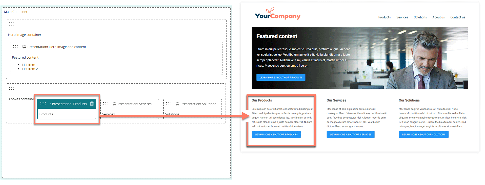

# Pages

<head>
  <meta name="guidename" content="Flow"/>
  <meta name="context" content="GUID-15c245e1-5232-4173-8a85-dae7ea7f060b"/>
</head>

Build, design, and edit your flow pages with the page builder.

## Overview

Pages define what a page map element looks like, and what functionality it has, when it is viewed in a running flow.

When you add a [page map element](/docs/Atomsphere/Flow/topics/c-flo-ME_Page_539c415f-59d7-47d5-90ef-cb3a108b3010.md) on the flow canvas, you must also link it to a page.

For example:

-   A **page map element** on the canvas defines where a page is in a flow.

-   A linked **page** defines the content actually displayed on the page, when the flow is viewed in a browser.

## Getting started

-   Start by creating and building a new page. See [Creating a page](/docs/Atomsphere/Flow/topics/t-flo-Pages_Creating_Page_Layout_8547b517-a2e6-4d0e-8ae3-736597064154.md).

-   Design, layout, and edit your pages in the drag-and-drop page builder. See [Using the page builder](/docs/Atomsphere/Flow/topics/flo-pages-builder_eafc591c-11b8-4924-835f-beff9aecd8c5.md).

    -   Pages are made up of **containers** that form the structure and layout of the page, and **components** that produce the actual pieces of content on the page when viewed in a browser.

-   Create and manage your pages on the **Pages** page. See [Pages page](/docs/Atomsphere/Flow/topics/c-flo-Pages_Page_Layout_Page_3834be68-0ef5-4c4a-ac59-3d75e6ddcd35.md).

-   Pages can be linked to multiple page map elements, and flows within your tenant.

    -   If you are re-using a page across multiple flows and/or page map elements, note that any changes made to the page will affect all page map elements using the page.