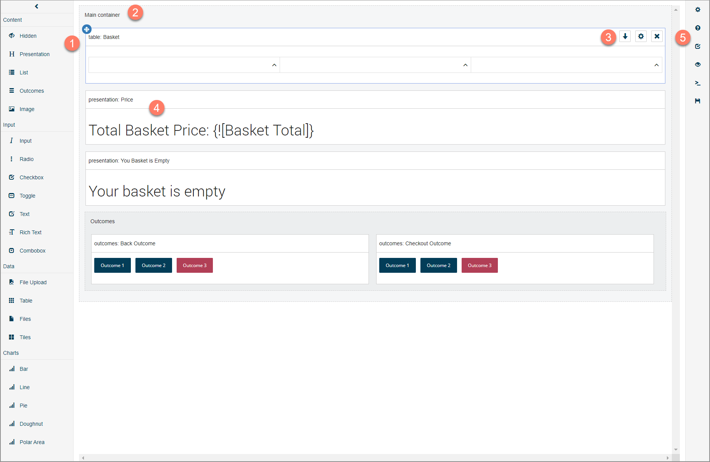

# Using the page layout editor

<head>
  <meta name="guidename" content="Flow"/>
  <meta name="context" content="GUID-7de4391e-78b0-4a2f-90aa-d024fa35f920"/>
</head>

Build and configure page layouts using the page layout editor.

-   The left-hand menu displays all the components  that you can add to a page layout. See [c-flo-Pages\_Components\_3e64eda7-58bc-4279-b825-7b333126506d.md](c-flo-Pages_Components_3e64eda7-58bc-4279-b825-7b333126506d.md).

-   The page structure is built and laid out using containers. The main content for the page is contained within the Main container.  See [c-flo-Pages\_Containers\_Quickstart\_0b65cb98-79ea-40e9-a388-92d16277eb6f.md](c-flo-Pages_Containers_Quickstart_0b65cb98-79ea-40e9-a388-92d16277eb6f.md).

-   Containers can then be added by clicking on the **Add Container** icon from the container options at the top right of each container.  See [Adding containers to a page layout](t-flo-Pages_Containers_Adding_092111dc-139d-49b0-b2be-665113d158a5.md) and [c-flo-Pages\_Containers\_Options\_f8abee44-a463-40e4-a5eb-c06372cda695.md](c-flo-Pages_Containers_Options_f8abee44-a463-40e4-a5eb-c06372cda695.md).

    These options are only displayed once you have clicked on a container, and allow you to configure properties such as the way a container is displayed and the position of a container on the page. Containers can be nested inside other containers.

-   Components can then be dragged and dropped from the left-hand menu into a container  and further configured in order to build up the structure and content of the page. See [c-flo-Pages-Components\_Adding\_25aa0e39-e1cc-48e0-99eb-84c342c70b7b.md](c-flo-Pages-Components_Adding_25aa0e39-e1cc-48e0-99eb-84c342c70b7b.md).

-   The right-hand menu options allow you to configure the page layout , including:

    -   Setting the page layout configuration properties.

    -   Adding simple and complex page conditions. See [Page conditions](flo-Conditions_a464b2d7-8eee-4b12-bf1c-0335ecf2df17.md).

    -   Previewing the page layout. See [c-flo-Pages\_Previewing\_Page\_Layouts\_9173313a-1ceb-4d9d-aa38-78cfcd340a78.md](c-flo-Pages_Previewing_Page_Layouts_9173313a-1ceb-4d9d-aa38-78cfcd340a78.md).

    -   Editing the page layout metadata. See [c-flo-Pages\_Page\_Layout\_Metadata\_402f7b68-cedd-44c0-bb4d-b7376d341f27.md](c-flo-Pages_Page_Layout_Metadata_402f7b68-cedd-44c0-bb4d-b7376d341f27.md).

    -   Making a copy of a page layout. See [c-flo-Pages\_Cloning\_Page\_Layout\_04663f35-b7a2-43b1-b2c2-d12462f5b357.md](c-flo-Pages_Cloning_Page_Layout_04663f35-b7a2-43b1-b2c2-d12462f5b357.md).

    -   Saving the page layout. Page layouts are not saved automatically, and must be manually saved using the **Save** option in the right-hand menu.